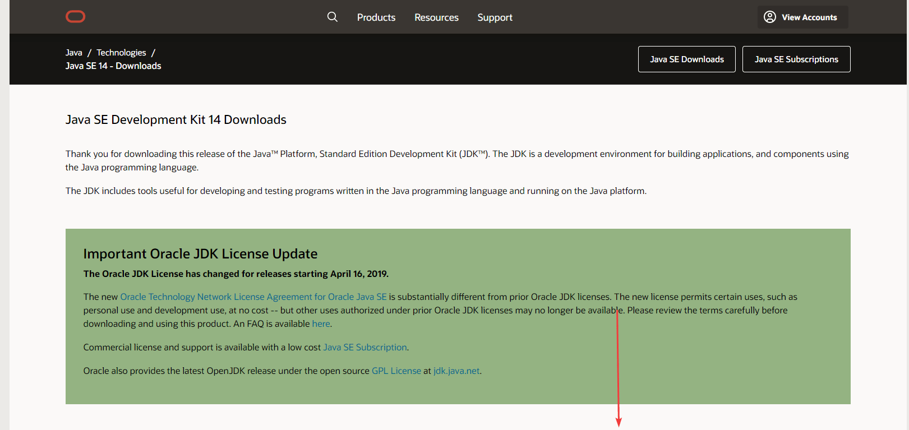
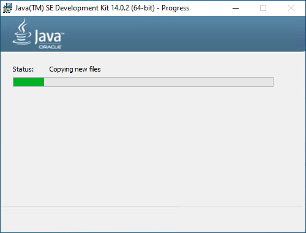

# Установка JDK в Windows

Для программирования под Java и, в частности, при создании приложений под Android на компе требуется установка JDK (Java Development Kit). В статье рассказывается как это сделать.

В статье рассматривается способ установки под Widows 10, но никакой разницы для других версий Windows не должно быть. Если вам нужна JDK более младшей версии или у вас, например, 32-битная Windows, то посмотрите [статью](/blog/2014/install-jdk-on-windows/) про установку JDK 8.

Скачиваем и устанавливаем с официального сайта:

<http://www.oracle.com/technetwork/java/javase/downloads/index.html>

Скачиваем последнюю версию JDK (на 07.2019 это Java 12):

Процесс установки обычный и не представляет никаких трудностей:

