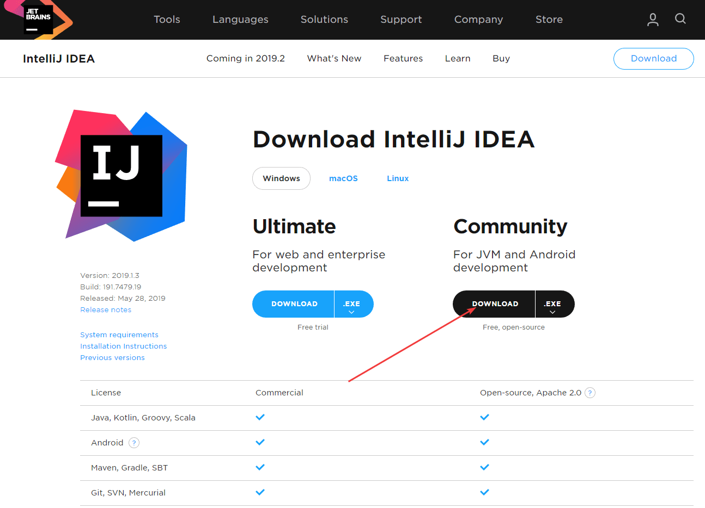
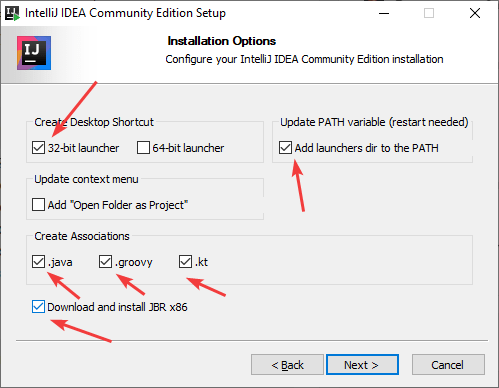
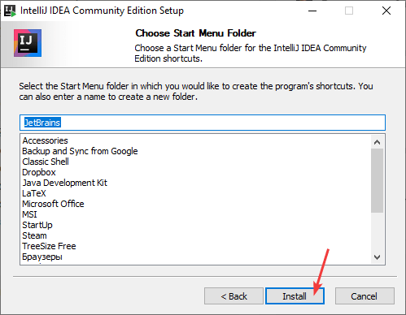
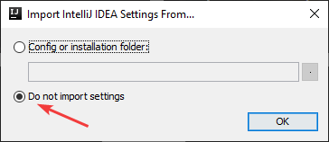
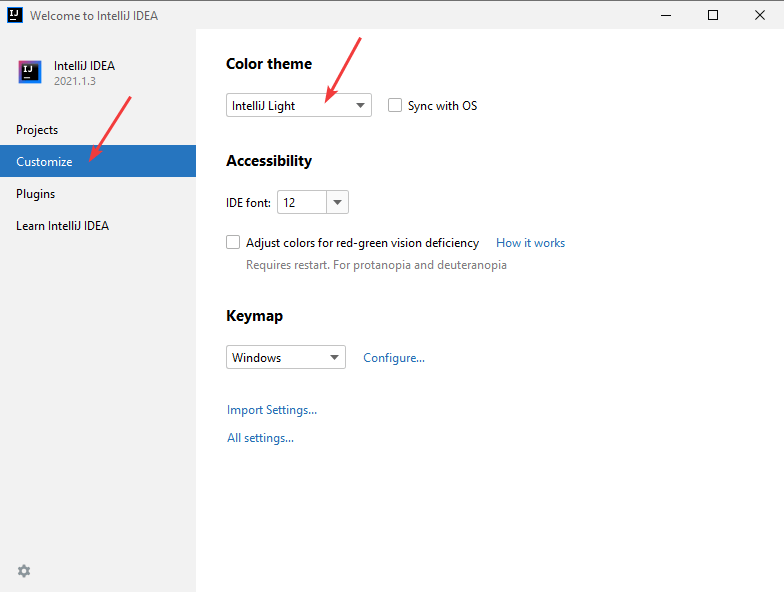
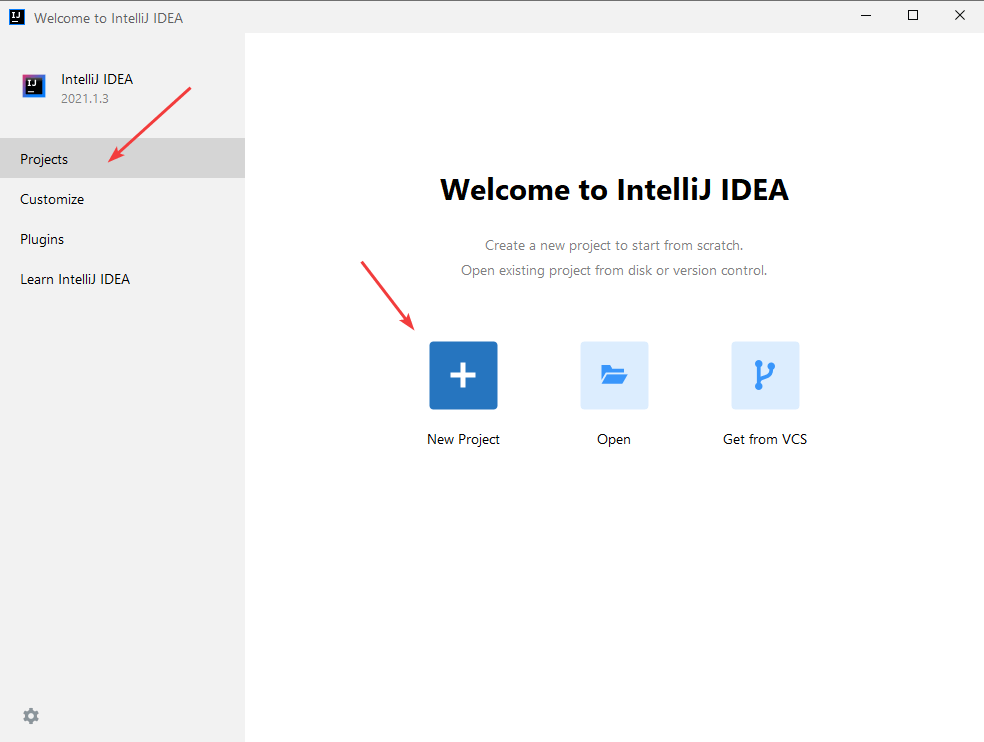
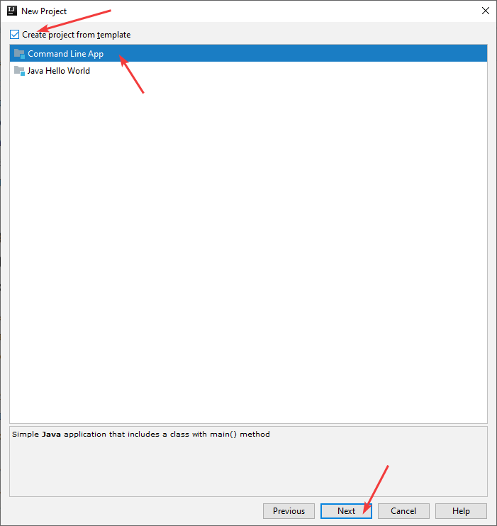
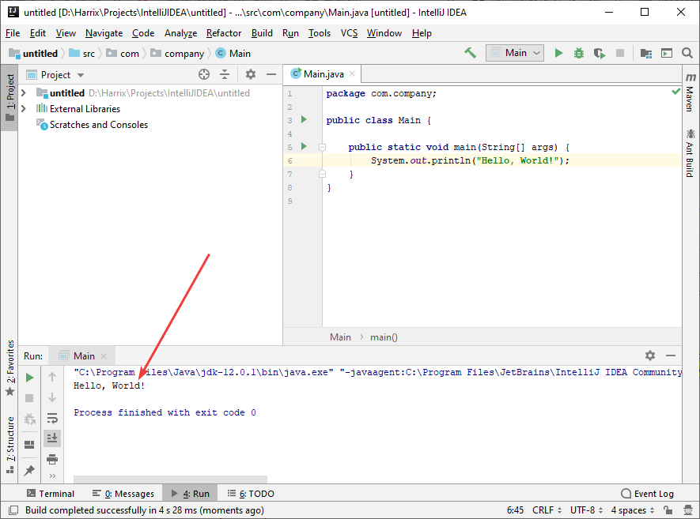

# Установка IntelliJ IDEA в Windows

В статье рассказывается, как установить IntelliJ IDEA.

## Установка JDK

Вначале необходимо установить **JDK**. Всё просто, но если есть вопросы, то подробно можно узнать в статье: [Установка Open JDK в Windows](https://github.com/Harrix/harrix.dev-blog-2021/blob/main/2021-08-09-install-open-jdk-on-windows/2021-08-09-install-open-jdk-on-windows.md).

## Скачивание IntelliJ IDEA

Идем на сайт: <https://www.jetbrains.com/idea/>.

Скачиваем там последнюю версию IntelliJ IDEA:


Выбираем именно Community версию:



## Установка IntelliJ IDEA

Установка простая. Запускаем скаченный EXE файл:


Если у вас 32-битная операционная система, то и выбираем 32-битные компоненты:






Программа установилась. Запускаем её, не забыв перезагрузить компьютер.

## Первоначальная настройка IntelliJ IDEA

При первом запуске спросит про импорт настроек с прежних установок данной программы. Если таковых не было, то говорите, что не хотите:



Выбираем тему редактора. Мне нравится светлая тема. А также плагины выбираем по умолчанию:



## Создание нового приложения



Если вы у себя видите на месте SDK фразу `No SDK` в отличии от скриншота внизу, то нужно вначале будет выбрать SDK, которым будем компилировать приложения, через кнопку `New...`:


У меня JDK находится в папке `C:\Program Files\Java\jdk-12.0.1`. Выбираем это месторасположение (у вас может быть другое), если JDK не определяется автоматически.

Говорим, что хотим создать приложение уже с готовым шаблоном (будет присутствовать метод `Main`):



Выбираем название проекта, папку для размещения проекта (по своему усмотрению):


Возможно, что вас спросят создать новую папку под проект. Соглашайтесь:


Всё. Создался проект консольного приложения Java. Если наверху справа появится желтая надпись `Attach annotations`, как на скриншоте внизу, то щелкните по ней:


## Запуск приложения

В методе `main` пропишем простейшую команду:

```java
System.out.println("Hello, World!");
```


Запустим проект:


В консоли отобразился результат выполнения программы:



## Дополнительные настройки

Настройки, описанные в данном разделе, опциональны, и можно их вообще не трогать.

Переходим в настройки приложения:


В разделе `General` я ставлю возможность увеличения шрифта колесиком мыши при нажатом `Ctrl`, а также устанавливаю правило, что при сохранении файла все лишние пробелы справа у всех строк будут удаляться:


## Дополнительно

В статье [Сложение двух чисел в IntelliJ IDEA на Java (консольное приложение)](https://github.com/Harrix/harrix.dev-blog-2019/blob/main/2019-07-15-add-2-num-intellij-idea/2019-07-15-add-2-num-intellij-idea.md) вы можете посмотреть пример того, как сложить два числа.
