# Установка Android Studio в Windows

В статье рассказывается, как установить Android Studio в Windows 10.

## Предварительные напутствия

Настоятельно рекомендую устанавливать Android Studio на 64-битную операционную систему. На сайте Android Studio даже нет полноценного установщика на 32-битную версию Windows (есть просто архив с программой без установки).

В идеале лучше использовать Windows 10 x64, но на Windows 8.1, 8, 7 тоже должно пойти.

Помните, что для Android Studio нужно минимум 4 Гб оперативной памяти (раньше было 2 Гб). Лучше иметь от 8 Гб и выше. Программа очень прожорливая. А на жестком диске нужно приличное количество места: лично у меня сейчас папка с Android Studio занимает 20,3 Гб (у вас по началу будет меньше).

Желательно иметь процессор от Intel, так как на процессорах AMD будут проблемы с эмуляторами Android. Но они решаемы.

И желательно, чтобы процессор имел поддержку виртуализации: сильно ускорит работу эмуляторов.

И если есть возможность и если пользователь на вашем компьютере называется по-русски, то поменяйте его на английское написание. Проблем с русскими именами будет много, причем не только в Android Studio. Очень много программ зарубежного производства рассчитаны на работу с файлами, в пути которых только латиница. Но если возможности нет для смены имени, то в статье будут описаны решения некоторых ваших проблем.

## JDK

Вначале необходимо установить **JDK**. Всё просто, но если есть вопросы, то подробно можно узнать в статье: [Установка JDK в Windows](/blog/2019/install-jdk-on-windows/).

## Скачивание Android Studio

Переходим по ссылке: <https://developer.android.com/studio/>.

Нажимаем на кнопку скачивания:

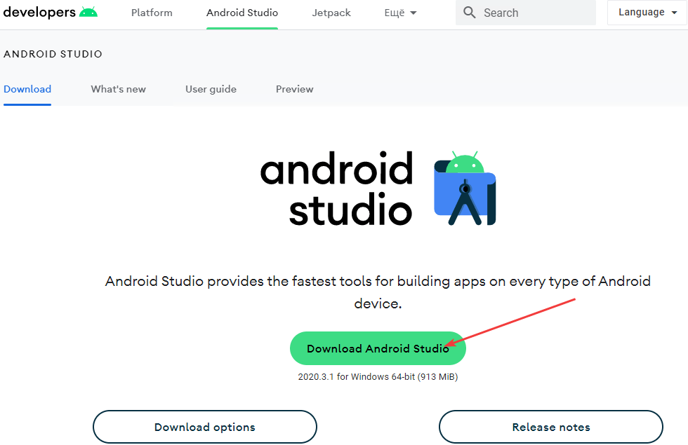

Соглашаемся с лицензией и скачиваем:

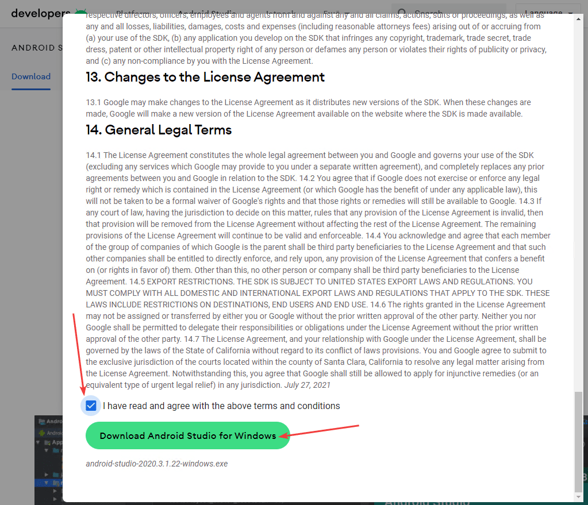

Если у вас Windows 32-битная и автоматически сайт это не определил, то можно скачать нужную себе версию:

Обратите внимание на то, что вам предложат скачать архив, а не установщик для 32-битной Windows. Этот архив нужно будет распаковать и запустить файл `studio.exe` в папке `bin` без установки:

## Установка 64-битной Android Studio

Запускаем скаченный файл:

Android Studio будет использовать несколько папок для своих нужд: сама программа, библиотеки SDK и др. И все папки будут по умолчанию находиться в разных местах.

Зачем нам? Создадим одну папку на вашем диске (например, `C:\Android` или `D:\Android`), в которую всё будем устанавливать. Создадим в этой папке папку `Android Studio` и `sdk`.

И в следующем окне установщика меняем путь установку приложения на нашу созданную папку:

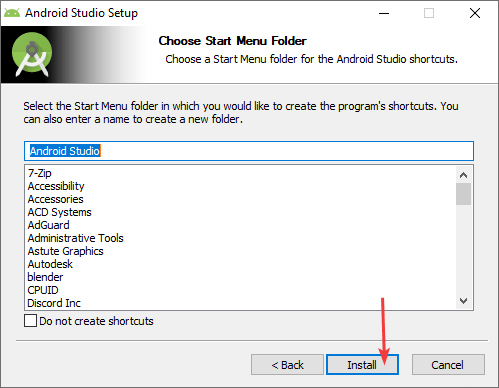

Да, на скриншоте выше и на следующих папка `Android` находиться на диске `D:\`, а не на `C:\`. Причина в том, что лично у меня Android Studio поставлен на второй диск `D:\`, так как в процессе работы размер папки `Android` может вырасти до 20 и более гигабайт, а SSD у меня не резиновый. На какой диск вы будете лично ставить: ваше личное предпочтение.

Далее по умолчанию, или выберете, где в меню `Пуск` будет находится Android Studio:

И пошел процесс установки:

## Первоначальная настройка Android Studio

При первом запуске Android Studio нас попросят выставить некоторые настройки. Сперва появится это окно:

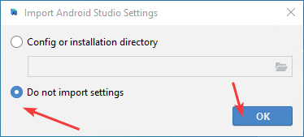

Выбираем расширенную настройку параметров:

Выбор светлой или темной темы:

Очень важный шаг! Если вы думали, что при установке Android Studio всё поставилось, то вынужден вас разочаровать.

Во-первых, нам нужно установить эмулятор Android (особенно если у вас нет физического реального устройства под Android).

Во-вторых, помните, как мы создавали папку `Android\sdk`? Вот теперь наступил момент, когда её указываем в качестве расположения SDK:

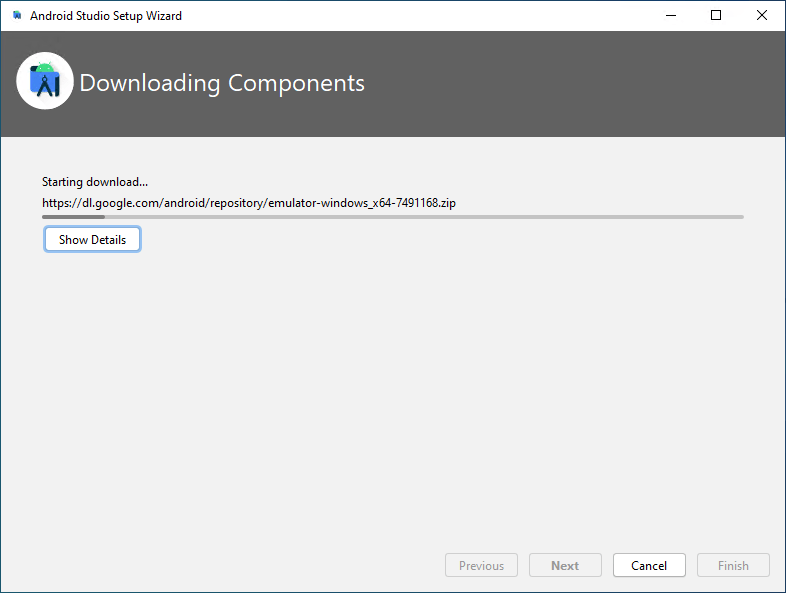

Выбираем объем оперативной памяти для эмулятора. Если у вас много оперативной памяти в компьютере, то можно указать объем побольше. Меньше 2 Гб лучше не указывать:

Список того, что будет установлено:

Сама установка:

Хорошо, если в окне окончания установки не будет красного текста, который свидетельствует о том, что что-то не установилось. Например, обладатели AMD процессоров возможно увидят сообщение, что не установился HAXM. Это будет означать, что стандартный эмулятор вы скорее всего нормально не запустите, но Android Studio будет работать полноценно. Если у вас появились другие сообщения об ошибках, то это плохо. Окончание установки:

## Создание нового приложения

Теперь создадим новое приложение:

Выбираем болванку нашего приложения `Empty Activity`:

Раньше далее шло несколько окон с разными настройками, но сейчас они все объединены в одно окно:

**Внимание!** В пути к проекту, как и в его названии, не должно быть **русских букв** и **пробелов**! По умолчанию Android Studio сохраняет проекты в папке пользователя компьютера. И если у вас пользователь написан русскими буквами, то ничего не запустится!

Поэтому рекомендую создать какую-нибудь папку, где будете располагать свои проекты. Например, у меня это папка `D:\Harrix\Projects\Android`. Вначале, когда я делал скриншот выше, я поменял путь на `D:\Harrix\Projects\Android`, но не всё так хорошо. Android Studio считает, что в папке `D:\Android\Projects` будет находиться только один наш новый проект. В других IDE этот момент продуман, а тут такой косяк возникает.

В общем, вручную дописываем название проекта в пути проекта, **убирая пробелы** из названия. Саму папку создавать не нужно: Android Studio создаст её сам. По итогу у меня получился путь `D:\Harrix\Projects\Android\MyApplication`. В последующие разы Android Studio будет создавать проекты по нормальному.

Также в этом окне выбираем язык Java как основной язык проекта (по умолчанию будет выбран Kotlin), минимальную версию Android, на котором будет запускаться приложение (версия 4.0.3, которая стоит по умолчанию, вполне сойдет).

И должно наконец-то появиться окно редактора Android Studio:

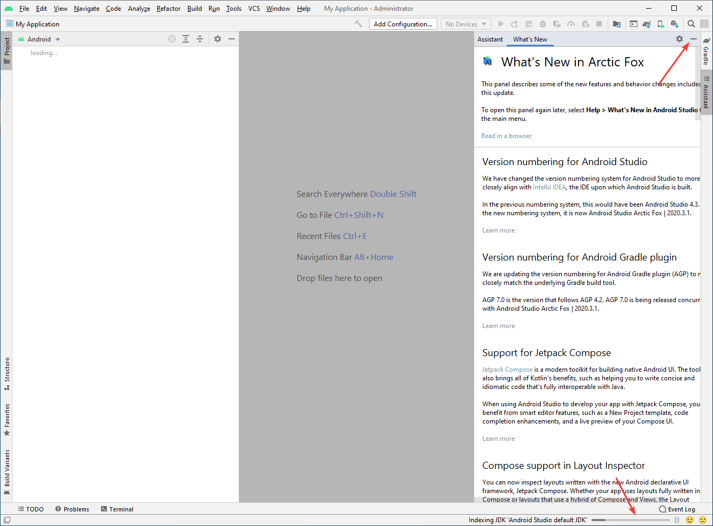

В этот момент начнет работать Gradle, чтобы синхронизировать нужные библиотеки. И пока внизу не прекратиться крутиться кружок, то проект не готов к работе. Если у вас компьютер слабый, то крутиться кружок будет долго:

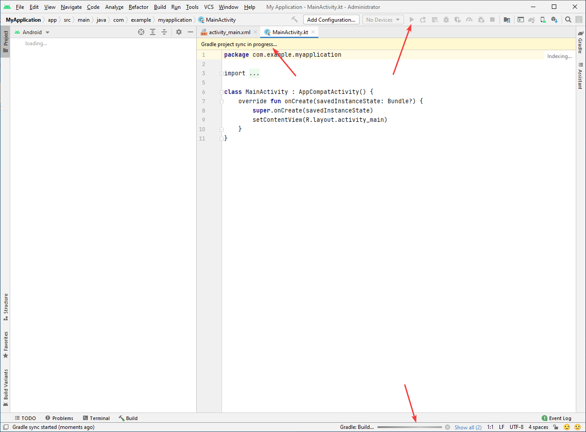

Возможно (не обязательно) внизу появится сообщение об ошибке `Install Tools ... and sync project`:

Эту ошибку вы будете встречать часто, когда будете открывать чьи-то проекты программ на Android Studio, сделанных не на вашем компьютере. Бояться её не нужно: просто щелкните по этой синей надписи `Install Tools ... and sync project`: Android Studio просто говорит, что ему нужны библиотеки SDK, которых нет у вас, и предлагает их скачать.

## Для тех у кого пользователь назван русскими буквами

Если у вас пользователь назван русскими буквами, то в предыдущем разделе столкнетесь с тем, что Gradle не синхронизирует проект и вообще он на всё ругается. Дело в том, что по умолчанию Gradle в новых версиях Android Studio ставит в отдельную папку, которая находится в папке пользователя.

Вам нужно поменять папку на другую. Создадите, например, папку `D:\Android\gradle`. Потом идите в настройки Android Studio:

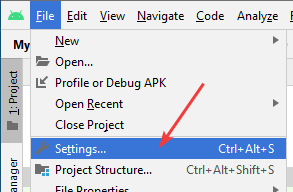

Там находим настройки Gradle. Видим, что Gradle сейчас находится в папке пользователя:

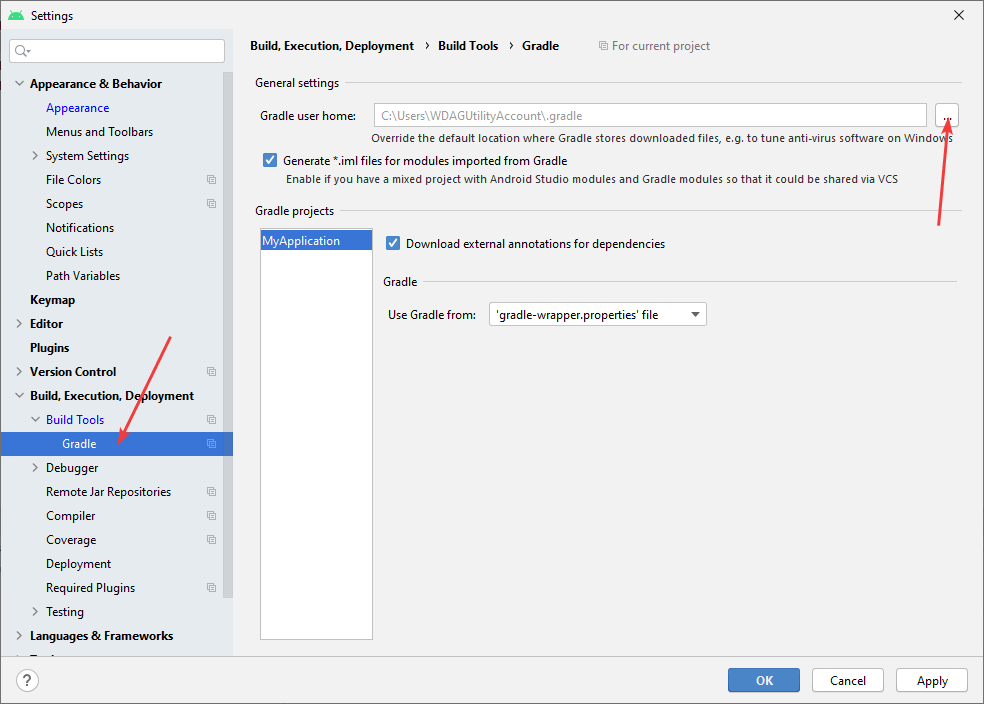

Меняем его на путь к папке, которую мы создали, например, это `D:\Android\gradle`:

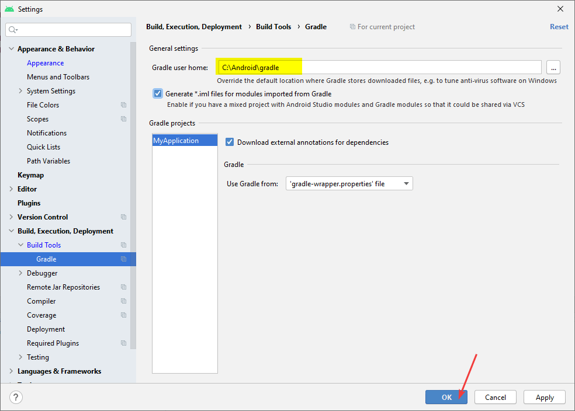

Но после нажатия `OK` ничего не произойдет (правда в этот раз у меня слетела светлая тема оформления). Нужно Gradle синхронизировать принудительно. Для этого наверху есть кнопка `Sync Project with Gradle Files`:

И начнется небыстрый процесс скачивания и установки gradle в новую папку с последующей синхронизацией проекта:

Чтобы убедиться, что всё прошло хорошо, то можно посмотреть папку `D:\Android\gradle`, где должны появиться следующие папки:

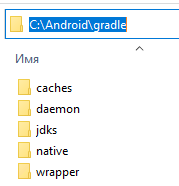

Так как у меня слетела тема оформления, то нужно её вернуть (`File` → `Settings...`):

## Настройка SDK

Надеялись, что всё установили? Нет, теперь нужно настроить SDK. Для этого из Android Studio нужно перейти в `SDK Manager`. Это можно сделать так:

В разделе `SDK Platforms` вы выбираете те версии Android, которые вам потребуются. Можно, например, выбрать последнюю стабильную и минимальную версию,под которой всё должно работать, как показано на скриншоте ниже:

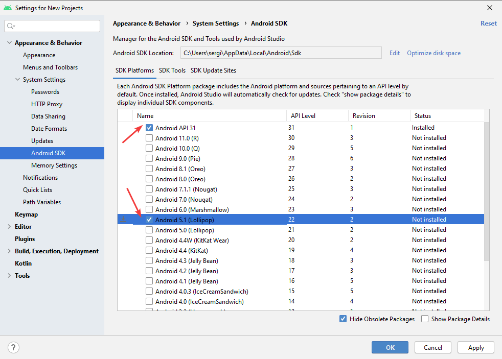

В `SDK tools` выберете `Google USB Driver` (чтобы можно было подключать планшеты и смартфоны), `Google Web Driver`:

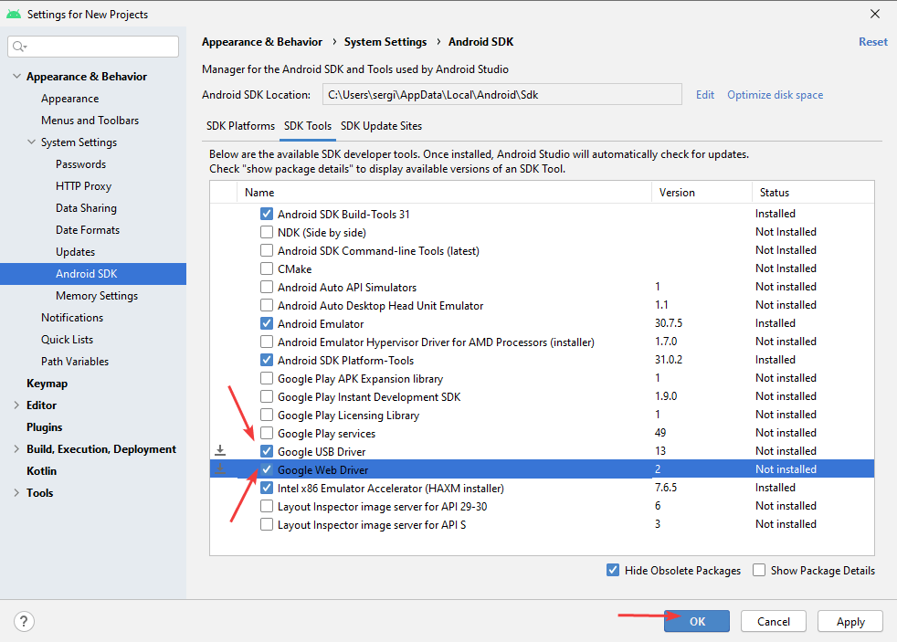

Нажимаете на `OK` и начинается процесс установки:

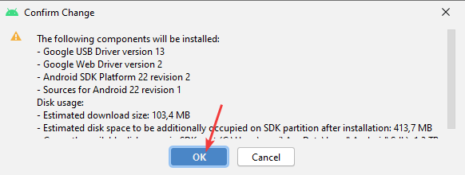

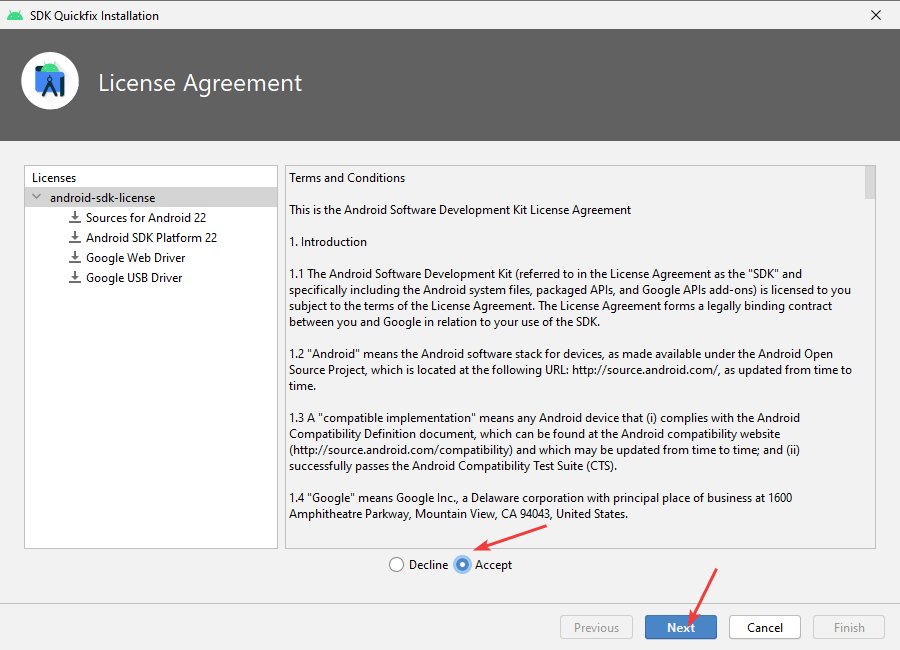

## Создание виртуального устройства

Если у вас нет физического Android устройства, или же вы хотите своё приложение протестировать на конкретных устройствах с конкретной версией Android, то вам нужно будет виртуальное устройство.

Идем в `AVD Manager`:

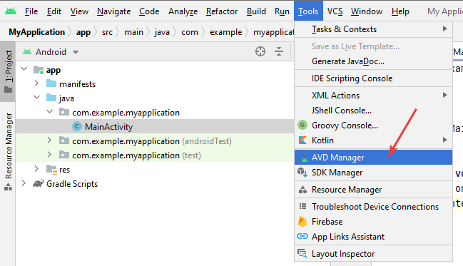

Как видим, уже есть одно виртуальное устройство, и можно больше не создавать, а перейти к следующему разделу по запуску приложения. Но мы попробуем сейчас создать еще одно:

Выбираем, какое устройство будем создавать. Допустим, мы хотим создать эмулятор `Nexus 5`:

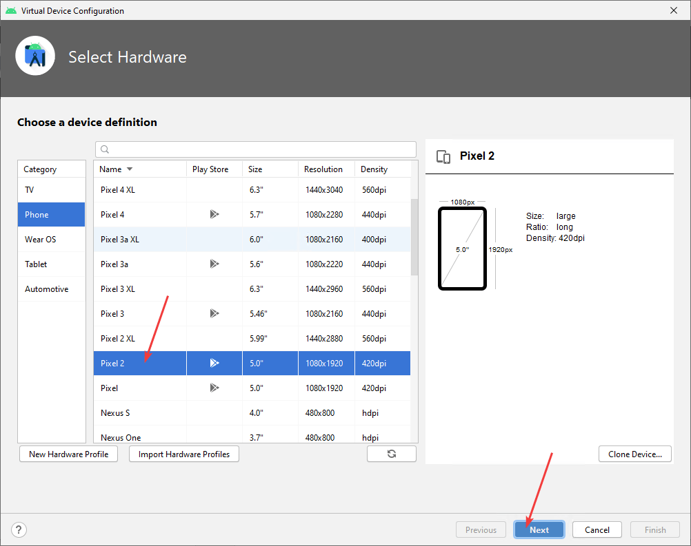

**Внимание!** Важный шаг. Для эмулятора нужен образ версии Android, который будет устанавливаться на эмулятор. И вам нужно будет его скачать, нажав на `Download`. Например, нам нужен Android 7.1.1:

Рекомендую выбирать версию Android от 6 и выше. Например, в этот раз вначале я хотел создать эмулятор с Android 5, который был успешно создан. Но при попытке запуска приложений на нем возникала ошибка такого вида:

Обычно такая ошибка решается отключением `Instant Run` в настройках, но в этот раз не помогало. Так что еще раз рекомендую выбирать версию Android от 6 и выше (с ними у меня проблемы не возникли).

Если вы обладатель AMD процессора, то вполне вероятно, что образ Android x86 не заработает у вас, поэтому нужно выбирать (после неудачной попытки с образом x86) образ Android из другой вкладки под `armeabi-v7a`. Но сразу предупреждаю: если у вас эмулятор под `armeabi` заведется всё-таки, то работать он будет очень медленно, и было на практике много случаев, когда эмулятор потом так и не запускался:

После нажатия на кнопку `Download` начнется скачивание образа:

После этого образ Android будет доступен для выбора и можно продолжить создание виртуального устройства:

Здесь всё можно оставить по умолчанию:

Попробуем запустить эмулятор:

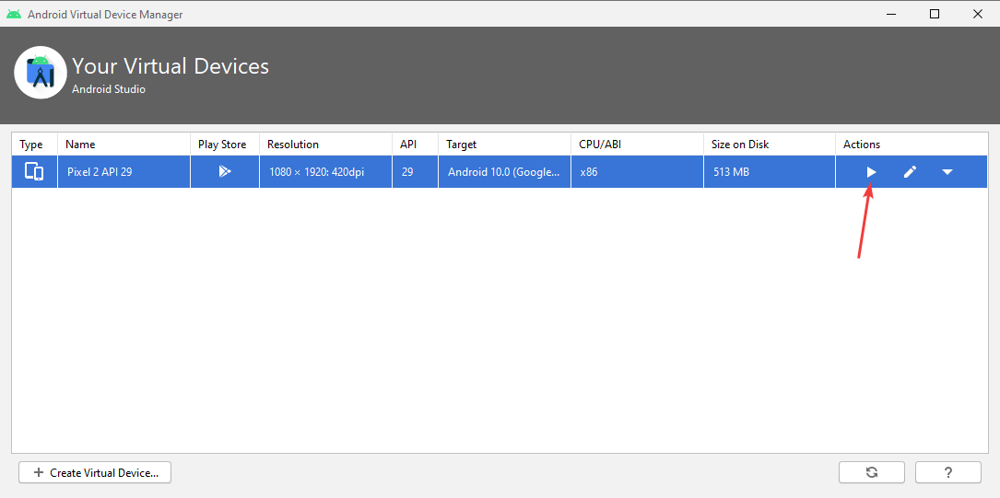

Если через какое-то время у вас в эмуляторе запустился полноценный Android, то всё замечательно:

Можно пока его не закрывать, так как будем его использовать для запуска нашего приложения. Но для будущего есть рекомендация: закрывать эмулятор лучше через крестик, а не через кнопку питания, которая находится чуть ниже: практика показывает, что при отключении питания потом эмулятор может не запуститься:

## Другие эмуляторы

Если родной эмулятор от Android Studio не запускается или тормозит так, что работать нельзя, то можно попробовать сторонние эмуляторы, благо их много.

[Genymotion](/blog/2018/genymotion-for-android-studio/) — по работе похож на родной эмулятор Android Studio. Можно устанавливать образы разных версий Android.

[Koplayer](/blog/2018/koplayer-for-android-studio/) — говорят, что он нетребователен к оперативной памяти и работает даже при 2 Гб оперативки.

[BlueStacks](/blog/2018/bluestacks-for-android-studio/) — известный эмулятор, предназначенный в первую очередь для запуска игр Android на ПК, но его можно использовать и для Android Studio.

[Nox](/blog/2018/nox-for-android-studio/) — еще один популярный эмулятор от китайцев, которым лично много пользовался.

## Запуск приложения

Теперь у нас Android установлен и настроен. Мы создавали приложение до этого. Давайте его запустим. Для этого щелкаем по зеленому треугольнику в панели инструментов:

Или из главного меню вызвать такую же команду:

Обратите внимание на то, что раньше в Android Studio после нажатия на кнопку запуска предлагалось выбрать устройство, на котором будет происходить запуск, то сейчас вначале нужно выбрать устройство в выпадающем меню слева от кнопки запуска:

Если вы выключили эмулятор, то можно либо его запустить через AVD Manager, либо тут выбрать эмулятор и по нему щелкнуть. Но если у вас устройство медленное, и эмулятор запускается долго, то лучше его запустить заранее.

Вас могут попросить что-нибудь дополнительно установить (привыкайте к этому):

Ждем, когда Gradle соберет проект, сформирует APK файл и загрузит его на устройство:

## Как запустить на реальном физическом устройстве

Вначале включим режим `Для разработчиков` на телефоне.

Зайдите в настройки телефона и в разделе `О телефоне` найдите пункт `Номер сборки`. Щелкните по нему **7 раз**. На скриншоте ниже мне пишут: «Не нужно, вы уже разработчик», — так как я уже нажимал 7 раз на этот пункт в прошлом:

Теперь в настройках телефона уровнем выше должен появиться пункт `Для разработчиков`:

В нем нужно включить пункт `Отладка по USB`:

Теперь, если вы включите свой смартфон через кабель к компьютеру, то устройство должно увидеться в списке устройств:

Но оно не получится запустить приложение на нем, так как устройство имеет подпись `Unknown Device`. Это возникает по причине того, что на самом устройстве мы не разрешили компьютеру подключение. Разрешите:

Если вы пропустили это окно, то вытащите кабель и вставьте его обратно.

После разрешения доступа устройство должно появиться полноценно:

Теперь его можно выбирать при запуске приложения на телефоне:

Сейчас я описал алгоритм подключения устройства в общем случае на примере Windows 10 и OnePlus 3t с Android 8.0. У вас подключение может отличаться. Лучше загуглить подключение вашего устройства к Android Studio. Пример запроса: `Galaxy A6 connect Android Studio Windows 7`.

Например, на Windows 7 нужно устанавливать драйвера телефона. Где взять для некоторых марок телефонов можно найти тут: <https://developer.android.com/studio/run/oem-usb>.

Для Samsung телефонов драйвера автоматически ставятся при установке приложений [Samsung](https://www.samsung.com/ru/support/app/kies/) (устройства с версией Android до 4.2 включительно) и [Samsung Smart Switch](https://www.samsung.com/ru/support/app/smartswitch/) (устройства с версией Android выше 4.2).

Windows 10 обычно все драйвера находит автоматически (это огромный плюс этой операционной системы).

Некоторые телефоны позволяют запускать приложения, если в Android Studio отключить `Instant Run` (телефоны Xiaomi этим грешат):

Но лучше погуглить подключение вашего устройства.

## Дополнительные настройки

Настройки, описанные в данном разделе, опциональны, и можно их вообще не трогать.

Переходим в настройки приложения:

В разделе `General` я ставлю возможность увеличения шрифта колесиком мыши при нажатом `Ctrl`, а также устанавливаю правило, что при сохранении файла все лишние пробелы справа у всех строк будут удаляться.

## Пример приложения

В статье [Сложение двух чисел в Android Studio на Java (Android приложение)](/blog/2019/add-2-num-android/) написано как вы можете написать простое приложение по сложению двух чисел.
