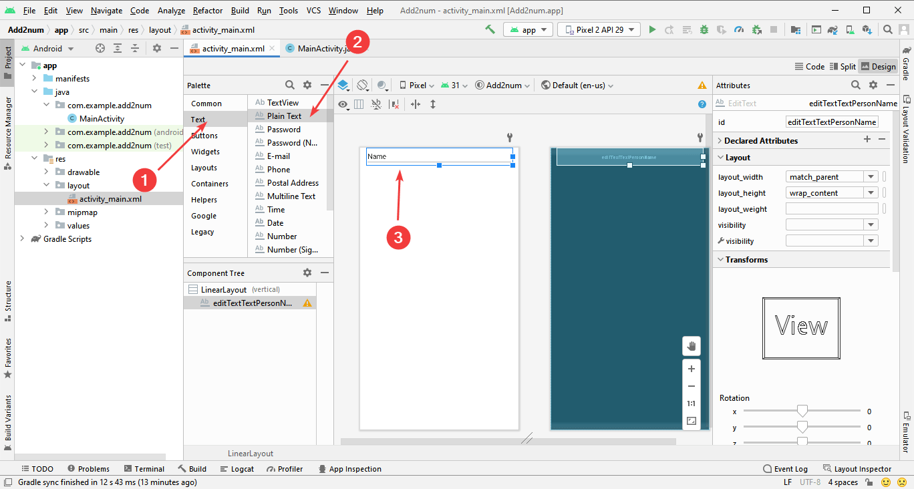

# Сложение двух чисел в Android Studio на Java (Android приложение)


В статье рассказывается как создать приложения сложения двух чисел в Android Studio для Android.

## Приготовления

В статье [Установка Android Studio в Windows](https://github.com/Harrix/harrix.dev-blog-2019/blob/main/install-android-studio/install-android-studio.md) <!-- https://harrix.dev/ru/blog/2019/install-android-studio/ --> узнаете, как установить и настроить Android Studio.

## Создание проекта


_Рисунок 1 — Создание нового проекта_


_Рисунок 2 — Выбор типа главной активности_


_Рисунок 3 — Выбор настроек проекта_


_Рисунок 4 — Готовый проект в Android Studio_

Перейдем вначале к файлу `activity_main.xml`, который отвечает за разметку внешнего вида приложения:


_Рисунок 5 — Переход к activity_main.xml_

## Размещение компонентов

По умолчанию в Android Studio в качестве разметки используется контейнер `ConstraintLayout`. Для новичков он не совсем простой. Поменяем на обычный `LinearLayout`.

Перейдем в текстовой режим разметки XML файла. Там мы внутри контейнера `ConstraintLayout` видим элемент `TextView` с фразой `Hello, World!`:


_Рисунок 6 — Переход к текстовому отображению activity_main.xml_

И заменим содержимое всего файла на следующий код:

```xml
<?xml version="1.0" encoding="utf-8"?>
<LinearLayout xmlns:android="http://schemas.android.com/apk/res/android"
    android:layout_width="match_parent"
    android:layout_height="match_parent"
    android:paddingLeft="16dp"
    android:paddingRight="16dp"
    android:orientation="vertical" >

</LinearLayout>
```

Перейдем обратно в режим дизайна:


_Рисунок 7 — Возвращение к визуальному редактированию activity_main.xml_

Перетащим текстовое поле:



_Рисунок 8 — Перетащенное текстовое поле_

Включим отображение атрибутов компонентов, если оно отключено:


_Рисунок 9 — Отображение атрибутов компонентов_

Поменяем значение поля `id` (имя компонента) на `editText`:


_Рисунок 10 — Идентификатор текстового поля_

Поменяем начальный текст в поле ввода на какое-нибудь число:


_Рисунок 11 — Изменение параметра text_

Перетащим еще одно текстовое поле, которое будет иметь имя `editText2`:


_Рисунок 12 — Второе текстовое поле_

Также поменяем начальный текст в поле ввода на какое-нибудь число:


_Рисунок 13 — Изменение параметра text_

Перетащим кнопку:


_Рисунок 14 — Кнопка_

Поменяем текст на кнопки, например, на `Сложить`:


_Рисунок 15 — Кнопка_

Перетащим поле с текстом для вывода:


_Рисунок 16 — Текстовое поле для вывода_

Начальный текст поменяем, например, на `=`:


_Рисунок 17 — Текстовое поле для вывода_

Начальный размер шрифта в TextView маленький, так что увеличим его. За это отвечает свойство `textSize`, которое можно найти либо в списке всех атрибутов, либо через поиск:


_Рисунок 18 — Текстовое поле для вывода_

Поменяем на `36sp`:


_Рисунок 19 — Текстовое поле для вывода_

В текстовом варианте получившаяся разметка будет такой:


_Рисунок 20 — Переход в режим текстового редактирования activity_main.xml_


_Рисунок 21 — Переход в режим текстового редактирования activity_main.xml_

```xml
<?xml version="1.0" encoding="utf-8"?>
<LinearLayout xmlns:android="http://schemas.android.com/apk/res/android"
    android:layout_width="match_parent"
    android:layout_height="match_parent"
    android:paddingLeft="16dp"
    android:paddingRight="16dp"
    android:orientation="vertical" >

    <EditText
        android:id="@+id/editText"
        android:layout_width="match_parent"
        android:layout_height="wrap_content"
        android:ems="10"
        android:inputType="textPersonName"
        android:text="2" />

    <EditText
        android:id="@+id/editText2"
        android:layout_width="match_parent"
        android:layout_height="wrap_content"
        android:ems="10"
        android:inputType="textPersonName"
        android:text="3" />

    <Button
        android:id="@+id/button"
        android:layout_width="match_parent"
        android:layout_height="wrap_content"
        android:text="Сложить" />

    <TextView
        android:id="@+id/textView"
        android:layout_width="match_parent"
        android:layout_height="wrap_content"
        android:text="="
        android:textSize="36sp" />
</LinearLayout>
```

Да, можно было не перетаскивать компоненты в визуальном режиме, а вручную написать этот код в текстовом режиме.

## Соединение компонентов с Java кодом

Перейдите в окно редактирования кода главной активности:


_Рисунок 22 — Переход в Java код активности_

Добавьте в класс три переменных, отвечающих за два текстовых поля ввода и одно текстовое поля вывода:

```java
private EditText editText;
private EditText editText2;
private TextView textView;
```


_Рисунок 23 — Объявление переменных в коде_

Видите, что в этих строчках есть красные слова (что означает наличие ошибки). Это от того, что не подключены библиотеки для этих типов данных. Курсор (каретку) щелкните по слову `EditText`, и нажмите `Alt` + `Enter`. И там выберите `Import class`:


_Рисунок 24 — Предложение решить проблему через Alt + Enter_


_Рисунок 25 — Импорт класса EditText_

Также сделайте с `TextView`:


_Рисунок 26 — Импорт класса TextView_

Краснота уйдет:


_Рисунок 27 — Отсутствие ошибок после импорта классов_

В методе `onCreate` соедините созданные переменные с теми полями, что объявлены в разметке.

**Внимание!** Добавлять эти строчки нужно после **setContentView**:

```java
editText = findViewById(R.id.editText);
editText2 = findViewById(R.id.editText2);
textView = findViewById(R.id.textView);
```


_Рисунок 28 — Место расположения кода с findViewById_

Обратите внимание, что значение `id` компонентов совпадают с `id` компонентов из XML файлов. То что названия Java переменных совпадают — это только для удобства:


_Рисунок 29 — Указание на ID элементов из XML файла_

Теперь надо прописать код обработки клика кнопки, чтобы при её нажатии считывались числа, складывались и сумма выводилась в TextView. Будет рассмотрено два способа.

## Первый способ обработки клика кнопки

Добавим в класс активности новый метод, например, с названием `clickButton`:

```java
public void clickButton(View v) {
}
```


_Рисунок 30 — Метод clickButton_

И через `Alt` + `Enter` убираем красноту:


_Рисунок 31 — Метод clickButton без красноты_

В метод него добавим код обработки клика кнопки:

```java
// Объявим числовые переменные
double a, b, c;

// Считаем с editText и editText2 текстовые значения
String s1 = editText.getText().toString();
String s2 = editText2.getText().toString();

// Преобразуем текстовые переменные в числовые значения
a = Double.parseDouble(s1);
b = Double.parseDouble(s2);

// Проведем с числовыми переменными нужные действия
c = a + b;

// Преобразуем ответ в число
String s = Double.toString(c);

// Выведем текст в textView
textView.setText(s);
```


_Рисунок 32 — Тело метода clickButton_

Полный код файла `MainActivity.java` у меня выглядит так:

```java
package com.example.add2num;

import androidx.appcompat.app.AppCompatActivity;

import android.os.Bundle;
import android.view.View;
import android.widget.EditText;
import android.widget.TextView;

public class MainActivity extends AppCompatActivity {

    private EditText editText;
    private EditText editText2;
    private TextView textView;

    @Override
    protected void onCreate(Bundle savedInstanceState) {
        super.onCreate(savedInstanceState);
        setContentView(R.layout.activity_main);

        editText = findViewById(R.id.editText);
        editText2 = findViewById(R.id.editText2);
        textView = findViewById(R.id.textView);
    }

    public void clickButton(View v) {
        // Объявим числовые переменные
        double a, b, c;

        // Считаем с editText и editText2 текстовые значения
        String s1 = editText.getText().toString();
        String s2 = editText2.getText().toString();

        // Преобразуем текстовые переменные в числовые значения
        a = Double.parseDouble(s1);
        b = Double.parseDouble(s2);

        // Проведем с числовыми переменными нужные действия
        c = a + b;

        // Преобразуем ответ в число
        String s = Double.toString(c);

        // Выведем текст в textView
        textView.setText(s);
    }
}
```

Обратите внимание на то, что, если вы проект в самом начале назвали по-другому (у меня он называется `Add2num`), то первая строчка с `package` у вас будет другой. И если вы бездумно скопируете строчку `package com.example.add2num;` в ваш проект, который называется по-другому, то у вас программа не соберется и не запустится!

Мы почти закончили, но мы нигде не прописали, что метод `clickButton` должен срабатывать при клике на кнопку. Исправим это.

Перейдем в XML файл разметки, в котором мы уже работали. И в нем в компоненте `Button` добавим строчку:

```xml
android:onClick="clickButton"
```


_Рисунок 33 — Изменения в XML файле_

Полный код файла `activity_main.xml`:

```xml
<?xml version="1.0" encoding="utf-8"?>
<LinearLayout xmlns:android="http://schemas.android.com/apk/res/android"
    android:layout_width="match_parent"
    android:layout_height="match_parent"
    android:paddingLeft="16dp"
    android:paddingRight="16dp"
    android:orientation="vertical" >

    <EditText
        android:id="@+id/editText"
        android:layout_width="match_parent"
        android:layout_height="wrap_content"
        android:ems="10"
        android:inputType="textPersonName"
        android:text="2" />

    <EditText
        android:id="@+id/editText2"
        android:layout_width="match_parent"
        android:layout_height="wrap_content"
        android:ems="10"
        android:inputType="textPersonName"
        android:text="3" />

    <Button
        android:id="@+id/button"
        android:layout_width="match_parent"
        android:layout_height="wrap_content"
        android:onClick="clickButton"
        android:text="Сложить" />

    <TextView
        android:id="@+id/textView"
        android:layout_width="match_parent"
        android:layout_height="wrap_content"
        android:text="="
        android:textSize="36sp" />
</LinearLayout>
```

## Запуск приложения

Если вы используете не физическое устройство, а эмулятор, то всегда рекомендую вначале запустить эмулятор, а потом уже запускать приложение:


_Рисунок 34 — Запуск AVD Manager_


_Рисунок 35 — Запуск эмулятора_


_Рисунок 36 — Запущенный эмулятор_

Теперь можем запускать наш проект:


_Рисунок 37 — Запуск компилирования проекта_


_Рисунок 38 — Запущенное приложение_

Введем какие-нибудь числа и нажмем кнопку:


_Рисунок 39 — Результат выполнения программы_

## Второй способ обработки клика кнопки

Теперь реализуем второй способ обработки клика, который я рекомендую использовать вместо первого. А чем плох первый? Мы в XML файле прописали, как называется метод из Java кода, который нужно запускать, то есть смешали код реализации и код разметки между собой. Это не очень хорошо. Попробуем не вносить изменения в XML файл (то есть строчку `android:onClick="clickButton"` добавлять не будем).

Добавим еще одну переменную для связки кнопки из XML файла с Java кодом. Красноту помните, как убирать:

```java
private Button button;
```


_Рисунок 40 — Объявление переменной button_

Также пропишите этот код:

```java
button = findViewById(R.id.button);
```


_Рисунок 41 — Код нахождения кнопки через findViewById_

А теперь напишем обработчик клика кнопки через `OnClickListener`. Пропишите такой код:

```java
button.setOnClickListener(new View.OnClickListener() {
    @Override
    public void onClick(View v) {

    }
});
```

**Внимание!** Обратите внимание, что в первом способе код обработки кнопки `clickButton` мы писали **вне** метода `onCreate`, а сейчас пишем **внутри** метода `onCreate`:


_Рисунок 42 — Обработчик клика кнопки_

Пропишем реализацию метода:

```java
// Объявим числовые переменные
double a,b,c;

// Считаем с editText и editText2 текстовые значения
String S1 = editText.getText().toString();
String S2 = editText2.getText().toString();

// Преобразуем текстовые переменные в числовые значения
a = Double.parseDouble(S1);
b = Double.parseDouble(S2);

// Проведем с числовыми переменными нужные действия
c = a + b;

// Преобразуем ответ в число
String s = Double.toString(c);

// Выведем текст в textView
textView.setText(s);
```


_Рисунок 43 — Реализация клика кнопки_

Полный код файла `MainActivity.java`:

```java
package com.example.add2num;

import androidx.appcompat.app.AppCompatActivity;

import android.os.Bundle;
import android.view.View;
import android.widget.Button;
import android.widget.EditText;
import android.widget.TextView;

public class MainActivity extends AppCompatActivity {

    private EditText editText;
    private EditText editText2;
    private TextView textView;
    private Button button;

    @Override
    protected void onCreate(Bundle savedInstanceState) {
        super.onCreate(savedInstanceState);
        setContentView(R.layout.activity_main);

        editText = findViewById(R.id.editText);
        editText2 = findViewById(R.id.editText2);
        textView = findViewById(R.id.textView);
        button = findViewById(R.id.button);

        button.setOnClickListener(new View.OnClickListener() {
            @Override
            public void onClick(View v) {
                // Объявим числовые переменные
                double a,b,c;

                // Считаем с editText и editText2 текстовые значения
                String S1 = editText.getText().toString();
                String S2 = editText2.getText().toString();

                // Преобразуем текстовые переменные в числовые значения
                a = Double.parseDouble(S1);
                b = Double.parseDouble(S2);

                // Проведем с числовыми переменными нужные действия
                c = a + b;

                // Преобразуем ответ в число
                String s = Double.toString(c);

                // Выведем текст в textView
                textView.setText(s);
            }
        });
    }
}
```

Файл Полный код файла `activity_main.xml` остался без изменений (строчки `android:onClick="clickButton"` тут нет):

```xml
<?xml version="1.0" encoding="utf-8"?>
<LinearLayout xmlns:android="http://schemas.android.com/apk/res/android"
    android:layout_width="match_parent"
    android:layout_height="match_parent"
    android:paddingLeft="16dp"
    android:paddingRight="16dp"
    android:orientation="vertical" >

    <EditText
        android:id="@+id/editText"
        android:layout_width="match_parent"
        android:layout_height="wrap_content"
        android:ems="10"
        android:inputType="textPersonName"
        android:text="2" />

    <EditText
        android:id="@+id/editText2"
        android:layout_width="match_parent"
        android:layout_height="wrap_content"
        android:ems="10"
        android:inputType="textPersonName"
        android:text="3" />

    <Button
        android:id="@+id/button"
        android:layout_width="match_parent"
        android:layout_height="wrap_content"
        android:text="Сложить" />

    <TextView
        android:id="@+id/textView"
        android:layout_width="match_parent"
        android:layout_height="wrap_content"
        android:text="="
        android:textSize="36sp" />
</LinearLayout>
```

При запуске мы получим такое же по функциональности приложение, как и при первом способе:


_Рисунок 44 — Запущенное приложение_
