# Сложение двух чисел в IntelliJ IDEA на Java (консольное приложение)

В статье рассказывается как создать консольного приложения сложения двух чисел под Java в IntelliJ IDEA.

## Приготовления

В статье [Установка IntelliJ IDEA в Windows](https://github.com/Harrix/harrix.dev-blog-2019/blob/main/install-intellij-idea/install-intellij-idea.md) узнаете, как всё установить и настроить.

## Создание проекта

Итак, открываем IntelliJ IDEA:

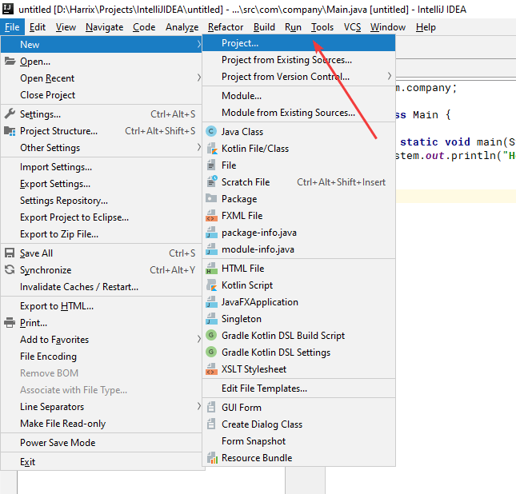

Убеждаемся, что тут стоит не `No SDK`:

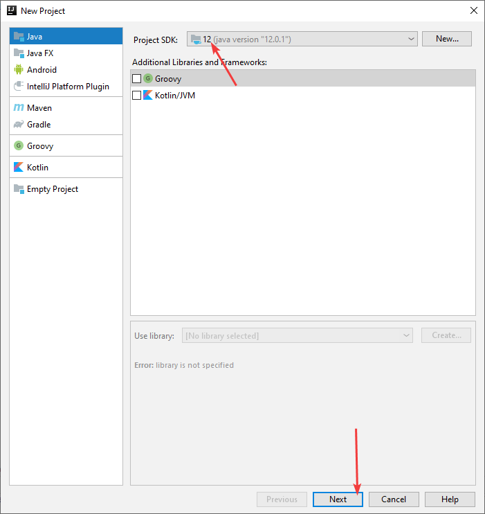

Выбираем шаблон консольного приложения:

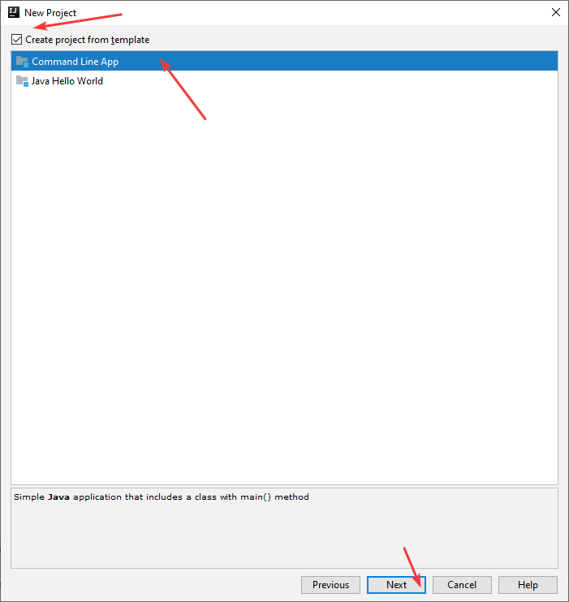

Выбираем имя приложения (без русских букв и пробелов) и папку размещения. Можете указать и свой домен, если таковой имеется, но для тестовых приложений это не важно:

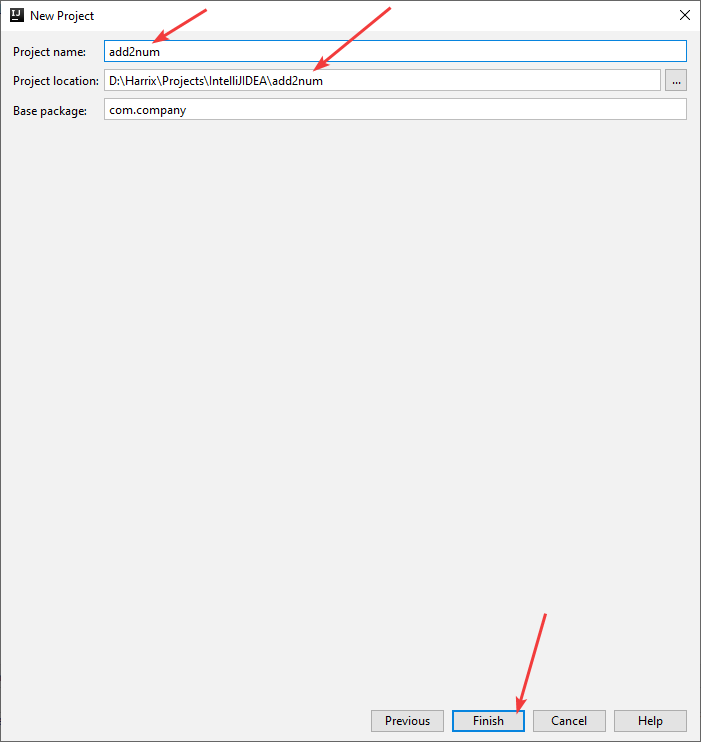

Если вы указали несуществующую папку, то он спросит у вас: создавать ее или нет:

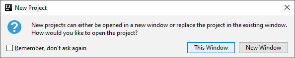

Потом предложит в том же окне открыть, что и предыдущий проект или в новом (если перед этим был открыт другой проект). Решайте сами: нужен ли вам открытый первый проект или нет.

И проект создан:

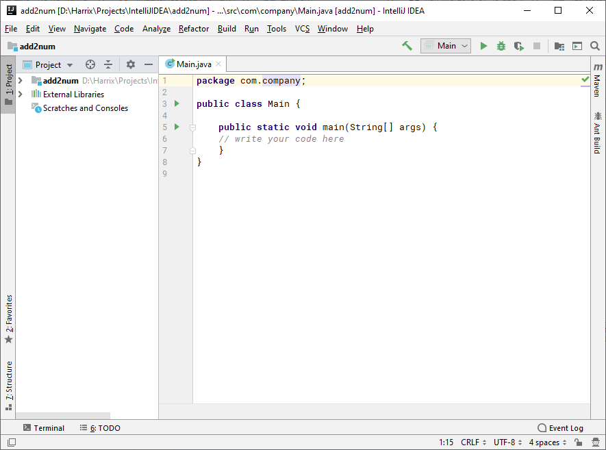

## Болванка приложения Java

Пропишем создание экземпляра класса `Scanner` для считывания данных с консоли в функции `main`:

```java
Scanner sc = new Scanner(System.in);
```

`Scanner` подсветится красным. Это означает, что соответствующие пакеты, в которых прописан данный класс не подключены:

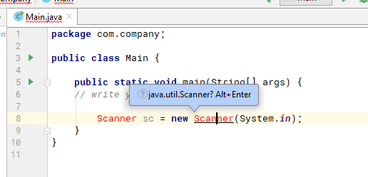

Поставим курсор на данном слове и нажмем `Alt` + `Enter`, чтобы подключить нужные библиотеки:

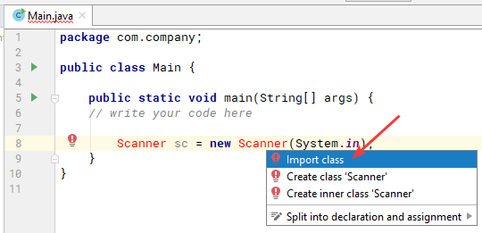

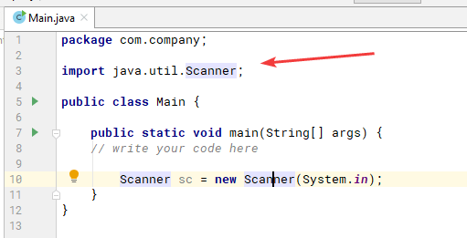

В итоге получаем болванку программы на Java, которую потом удобно использовать для других приложений учебного толка:

```java
package com.company;

import java.util.Scanner;

public class Main {

    public static void main(String[] args) {
  // write your code here

        Scanner sc = new Scanner(System.in);
    }
}
```

## Написание кода основной программы

А теперь пропишем основной код нашей программы:

```java
int a, b, c;

System.out.println("Введите первое число");
a = sc.nextInt();//Считываем первое число

System.out.println("Введите второе число");
b = sc.nextInt();//Считываем второе число

c = a + b;
System.out.println("c = " + c);
```

Полная программа будет выглядеть так:

```java
package com.company;

import java.util.Scanner;

public class Main {

    public static void main(String[] args) {
  // write your code here

        Scanner sc = new Scanner(System.in);

        int a, b, c;

        System.out.println("Введите первое число");
        a = sc.nextInt();//Считываем первое число

        System.out.println("Введите второе число");
        b = sc.nextInt();//Считываем второе число

        c = a + b;

        System.out.println("c = " + c);
    }
}
```

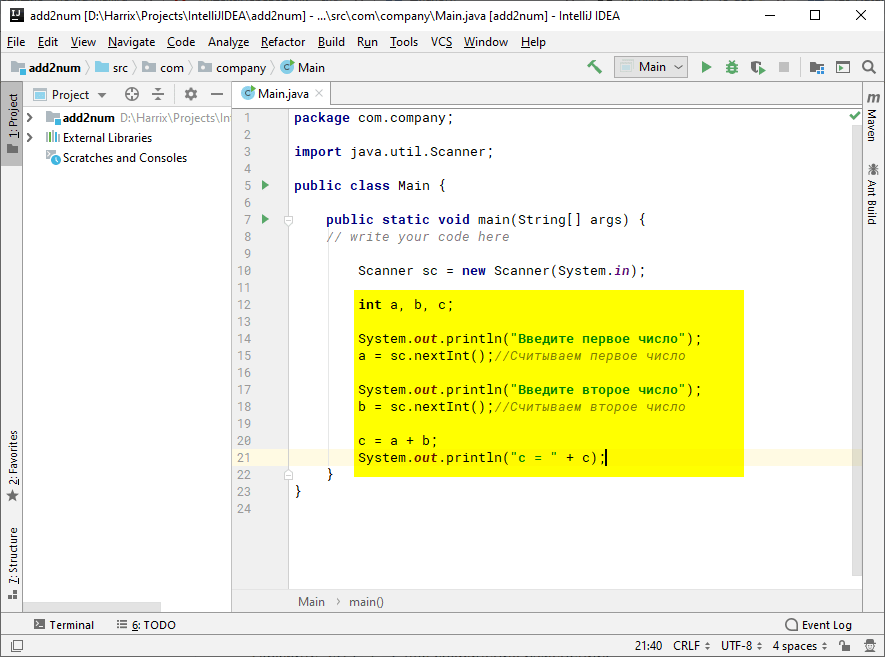

Нажмите `Ctrl` + `S` для сохранения изменений.

## Запуск программы

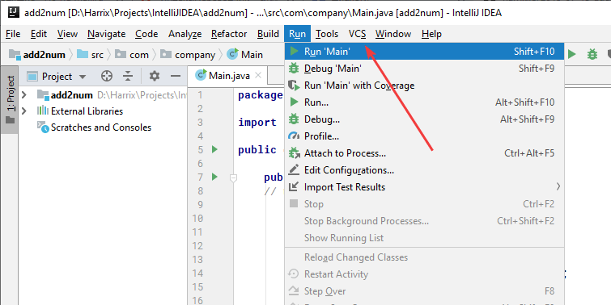

Если вы видите вопросы вместо `Введите первое число`, то под спойлером решение:

---

**Изменение кодировки** <!-- !details -->

Проблема касается старых версий IntelliJ IDEA:

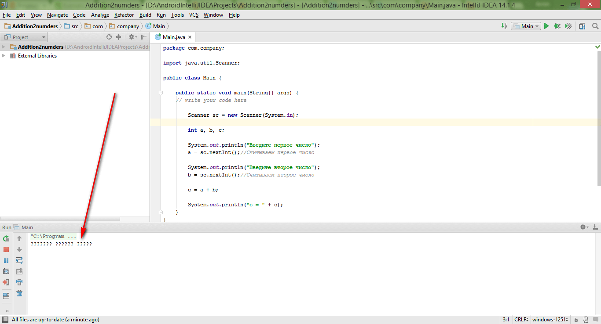

Дело в том, что старая IntelliJ IDEA по умолчанию создаваемые файлы кодирует не в UTF-8, а в windows-1251:

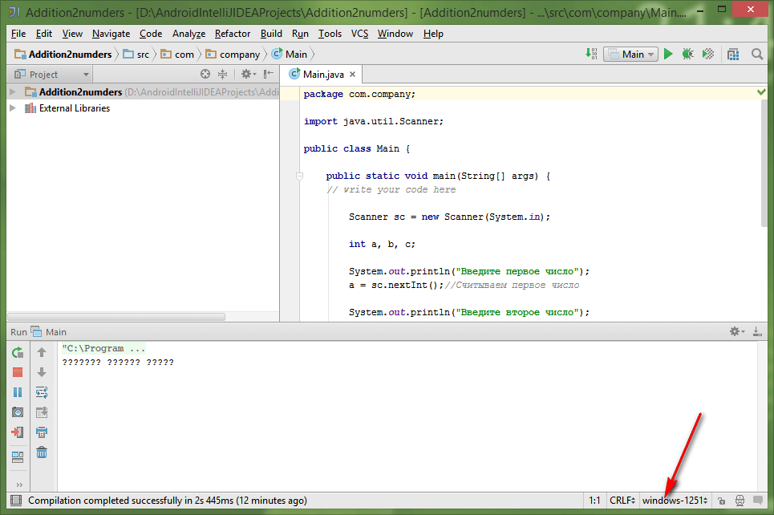

Исправим кодировку файла:

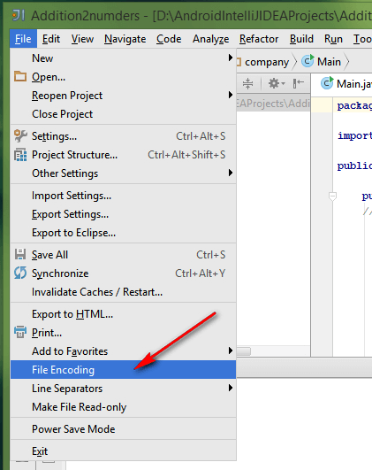

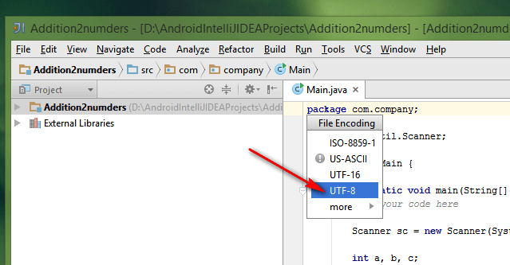

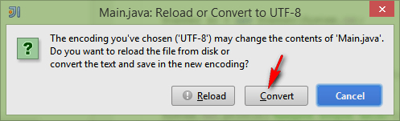

Теперь завершим принудительно предыдущий запуск приложения:

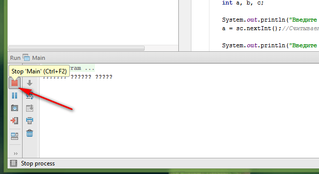

И повторно запустим наше приложение любым способом.

---

Получаем наше приложение:

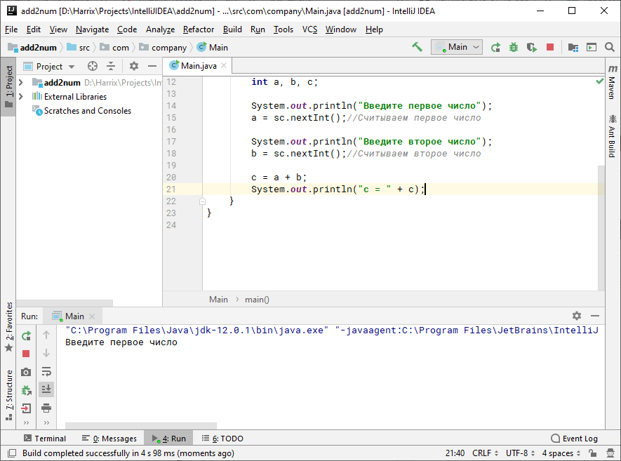

Тестируем приложение:

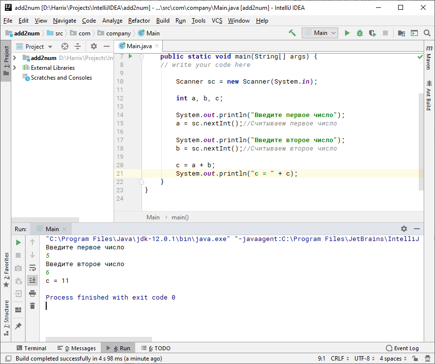

Наше приложение написано.
