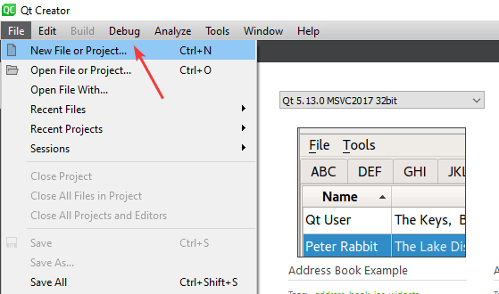
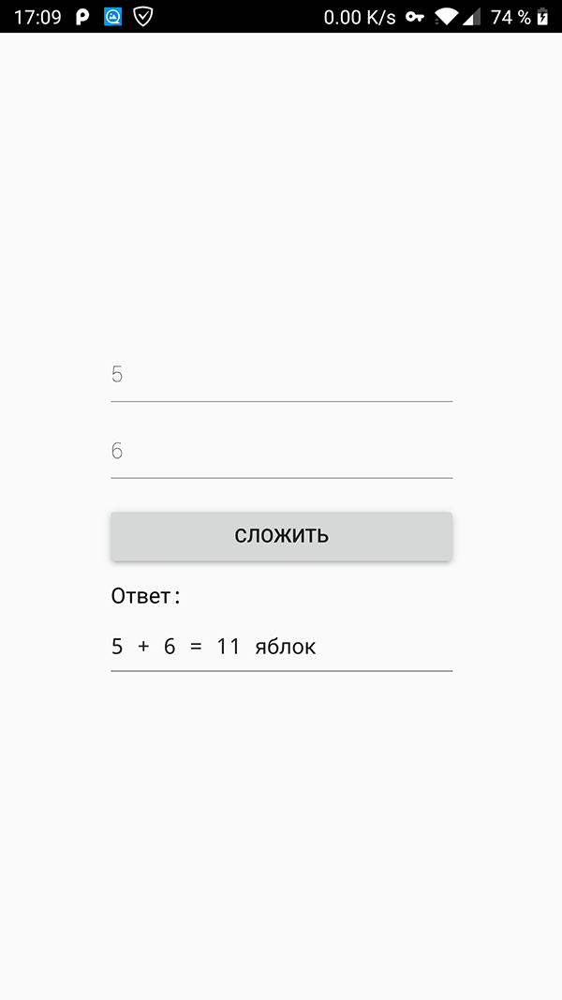

# Сложение двух чисел в Qt на C++ (Qt Quick Controls 2)

В статье описывается создание приложения QML через Qt Quick Controls 2 с выполнением кода на C++.

В качестве среды для разработки используется Qt 5.13.0 для Windows 64 bit под компилятор Visual Studio 2017.

В отличии от [статьи](https://github.com/Harrix/harrix.dev-blog-2016/blob/main/add-2-num-qt-quick-controls/add-2-num-qt-quick-controls.md) и [статьи](https://github.com/Harrix/harrix.dev-blog-2016/blob/main/add-2-num-qt-quick/add-2-num-qt-quick.md) в данной статьи рассматривается построение приложение не с использованием чистого QML или старых компонентов, а с использованием QtQuick Controls второго поколения.

## Подготовка

Создадим Qt Quick приложение:



Чтобы получить не пустое QML приложение, а с какой-нибудь болванкой с QtQuick Controls компонентами, то выберем, например, `Qt Quick Application - Stack`:


Выберем версию QML и первоначальное оформление компонентов:


И переведите разработку приложения в режим `Release`:


## Построение интерфейса

Так как при создании проекта мы брали болванку, то рекомендую удалить данные файлы, так как они нам не будут нужны:


Откроем файл `main.qml` и заменим содержимое на следующее:

```qml
import QtQuick 2.13
import QtQuick.Controls 2.13

ApplicationWindow {

  visible: true
  width: 640
  height: 480
  title: qsTr("Сложение двух чисел")

  Column {
    spacing: 10
    anchors.centerIn: parent

    TextField {
      id: field1
      objectName: "field1"
      placeholderText: "Введите первое число"
      width: 250
    }

    TextField {
      id: field2
      objectName: "field2"
      placeholderText: "Введите второе число"
      width: 250
    }

    Button {
      id: button
      text: qsTr("Сложить")
      width: 250
      onClicked: qmlSignal("яблок")
    }

    Text {
      text: "Ответ:"
      font.pixelSize: textArea.font.pixelSize
    }

    TextArea {
      id: textArea
      objectName: "textArea"
      wrapMode: TextArea.Wrap
      readOnly: true
      width: 250
    }
  }
}
```


Номера библиотек, которые прописаны в первых двух строчках можете взять из своей болванки, так как в момент прочтения статьи, возможно они уже поменяются.

Обратите внимание, что для всех элементов, к которым вы потом захотите обращаться в C++, пропишите не только свойство `id`, но и свойство `objectName` со строковым значением, совпадающим с `id`.

## C++ часть

При нажатии на кнопку пока ничего не происходит. Исправим это. Для начала установим взаимосвязь между QML моделью и C++ кодом. Для этого создадим класс, через которое будем осуществлять взаимодействие.

Правой кнопкой щелкнем по проекту и выбираем пункт `Add New…`:


Там выбираем `C++ Class`:


Там вводим название нашего нового класса, например, `HandlerSignals`, также добавив подключение инклуда `QObject` и базовым классом объявляем `QObject`:


В итоге получаем наш класс:


Начнем его редактирование. Перейдем вначале в заголовочный файл `handlersignals.h`.

Мы будем создавать экземпляр нашего объекта и передавать в качестве родителя сцену QML объектов.

Подключите файл `#include <QVariant>`.

Файл `handlersignals.h`:

```h
#ifndef HANDLERSIGNALS_H
#define HANDLERSIGNALS_H

#include <QObject>
#include <QVariant>

class HandlerSignals : public QObject
{
  Q_OBJECT
public:
  explicit HandlerSignals(QObject *parent = nullptr);

signals:

public slots:
};

#endif // HANDLERSIGNALS_H
```

Файл `handlersignals.cpp` (без изменений):

```cpp
#include "handlersignals.h"

HandlerSignals::HandlerSignals(QObject *parent) : QObject(parent)
{

}
```

Теперь можем добавить наш слот по обработке сигнала. Для примера мы передадим из сигнала текстовой фрагмент, который добавим в итоговое сообщение:

```cpp
void HandlerSignals::cppSlot(const QString &msg) {

  // Найдем строки ввода
  QObject* field1 = this->parent()->findChild<QObject*>("field1");
  QObject* field2 = this->parent()->findChild<QObject*>("field2");

  // Найдем поле вывода
  QObject* textArea = this->parent()->findChild<QObject*>("textArea");

  // Считаем информацию со строк ввода через свойство text
  QString str1 = (field1->property("text")).toString();
  QString str2 = (field2->property("text")).toString();

  int a = str1.toInt(); // Переведем строку в число
  int b = str2.toInt(); // Переведем строку в число

  int c = a + b; //Вычисления наши

  QString strResult = QString::number(c);//Переведем результат в строку

  // Ну и наконец выведем в поле вывода нашу информацию
  textArea->setProperty("text", str1 + " + " + str2+" = " + strResult + " " + msg);
}
```

Получим такие файлы:

Файл `handlersignals.h`:

```h
#ifndef HANDLERSIGNALS_H
#define HANDLERSIGNALS_H

#include <QObject>
#include <QVariant>

class HandlerSignals : public QObject
{
  Q_OBJECT
public:
  explicit HandlerSignals(QObject *parent = nullptr);

signals:

public slots:
  void cppSlot(const QString &msg);
};

#endif // HANDLERSIGNALS_H
```

Файл `handlersignals.cpp`:

```cpp
#include "handlersignals.h"

HandlerSignals::HandlerSignals(QObject *parent) : QObject(parent)
{

}

void HandlerSignals::cppSlot(const QString &msg) {

  // Найдем строки ввода
  QObject* field1 = this->parent()->findChild<QObject*>("field1");
  QObject* field2 = this->parent()->findChild<QObject*>("field2");

  // Найдем поле вывода
  QObject* textArea = this->parent()->findChild<QObject*>("textArea");

  // Считаем информацию со строк ввода через свойство text
  QString str1 = (field1->property("text")).toString();
  QString str2 = (field2->property("text")).toString();

  int a = str1.toInt(); // Переведем строку в число
  int b = str2.toInt(); // Переведем строку в число

  int c = a + b; //Вычисления наши

  QString strResult = QString::number(c);//Переведем результат в строку

  // Ну и наконец выведем в поле вывода нашу информацию
  textArea->setProperty("text", str1 + " + " + str2+" = " + strResult + " " + msg);
}
```

В прошлых вариантах подобных приложений (когда писал, например, для Qt 5.5.0) я регистрировал в QML экземпляр класса и вызывал методы-слоты класса. Но при этом QML становился привязан к C++ коду, что не есть хорошо. Поэтому сейчас поступим по другому. Мы в QML документе просто отправим сигнал, что нужно посчитать сумму двух чисел, а уже в C++ поймаем данный сигнал и отправим на обработку в класс.

Вначале отправим сигнал. В `main.qml` в головном элементе `ApplicationWindow` добавим сигнал:

```qml
signal qmlSignal(string msg)
```

Обратите внимание, что объявление сигнала надо добавлять именно в корневой элемент, иначе мы сигнал не найдем.

А в кнопке в области действия мыши пропишем уже отправку сигнала:

```qml
onClicked: qmlSignal("яблок")
```

В итоге получим файл `main.qml`:

```qml
import QtQuick 2.13
import QtQuick.Controls 2.13

ApplicationWindow {

  visible: true
  width: 640
  height: 480
  title: qsTr("Сложение двух чисел")

  signal qmlSignal(string msg)

  Column {
    spacing: 10
    anchors.centerIn: parent

    TextField {
      id: field1
      objectName: "field1"
      placeholderText: "Введите первое число"
      width: 250
    }

    TextField {
      id: field2
      objectName: "field2"
      placeholderText: "Введите второе число"
      width: 250
    }

    Button {
      id: button
      text: qsTr("Сложить")
      width: 250
      onClicked: qmlSignal("яблок")
    }

    Text {
      text: "Ответ:"
      font.pixelSize: textArea.font.pixelSize
    }

    TextArea {
      id: textArea
      objectName: "textArea"
      wrapMode: TextArea.Wrap
      readOnly: true
      width: 250
    }
  }
}
```

Запустите приложение. Конечно, у вас кнопка не сработает пока, но вы сможете проверить: есть ли ошибки или нет (если не запускается, то есть).

Теперь, перейдем в файл `main.cpp`, чтобы прописать создание экземпляра класса и связать его с нужными объектами.

Добавим заголовочный файл:

```cpp
#include "handlersignals.h"
```

А в функции `main` после загрузки QML файла пропишем строчки:

```cpp
QObject* root = engine.rootObjects()[0];

HandlerSignals *handlerSignals= new HandlerSignals(root);

QObject::connect(root, SIGNAL(qmlSignal(QString)),
handlerSignals, SLOT(cppSlot(QString)));
```

В первой строчке мы находим корневой объект в QML модели. Во второй строчке создаем экземпляр нашего класса. И в третьей строчке связываем наш слот из класса и сигнал из QML файла.

Теперь `main.cpp` выглядит вот так:

```cpp
#include <QGuiApplication>
#include <QQmlApplicationEngine>

#include "handlersignals.h"

int main(int argc, char *argv[])
{
  QCoreApplication::setAttribute(Qt::AA_EnableHighDpiScaling);

  QGuiApplication app(argc, argv);

  QQmlApplicationEngine engine;
  const QUrl url(QStringLiteral("qrc:/main.qml"));
  QObject::connect(&engine, &QQmlApplicationEngine::objectCreated,
                   &app, [url](QObject *obj, const QUrl &objUrl) {
    if (!obj && url == objUrl)
      QCoreApplication::exit(-1);
  }, Qt::QueuedConnection);
  engine.load(url);

  QObject* root = engine.rootObjects()[0];

  HandlerSignals *handlerSignals= new HandlerSignals(root);

  QObject::connect(root, SIGNAL(qmlSignal(QString)),
  handlerSignals, SLOT(cppSlot(QString)));

  return app.exec();
}
```

Если всё сделали правильно, то при запуске приложения и нажатия на кнопку получим следующее:


Кстати, данное приложение запускается и в Qt под MinGW в Android:


