# Установка IntelliJ IDEA в Windows


В статье рассказывается, как установить IntelliJ IDEA.

<details>
<summary>📖 Содержание</summary>

## Содержание

- [Установка JDK](#установка-jdk)
- [Скачивание IntelliJ IDEA](#скачивание-intellij-idea)
- [Установка IntelliJ IDEA](#установка-intellij-idea)
- [Первоначальная настройка IntelliJ IDEA](#первоначальная-настройка-intellij-idea)
- [Создание нового приложения](#создание-нового-приложения)
- [Запуск приложения](#запуск-приложения)
- [Дополнительные настройки](#дополнительные-настройки)
- [Дополнительно](#дополнительно)

</details>

## Установка JDK

Вначале необходимо установить **JDK**. Всё просто, но если есть вопросы, то подробно можно узнать в статье: [Установка Open JDK в Windows](https://github.com/Harrix/harrix.dev-articles-2021/blob/main/install-open-jdk-on-windows/install-open-jdk-on-windows.md) | [↗️](https://harrix.dev/ru/articles/2021/install-open-jdk-on-windows/).

## Скачивание IntelliJ IDEA

Идем на сайт: <https://www.jetbrains.com/idea/>.

Скачиваем там последнюю версию IntelliJ IDEA:


_Рисунок 1 — Ссылка на скачивание установщика_

Выбираем именно Community версию:

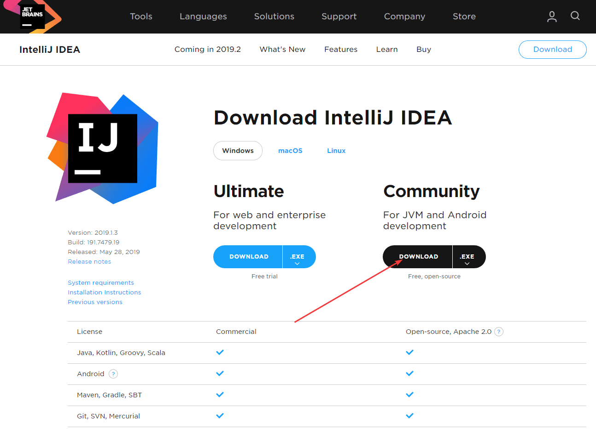

_Рисунок 2 — Выбор Community версии_

## Установка IntelliJ IDEA

Установка простая. Запускаем скаченный EXE файл:

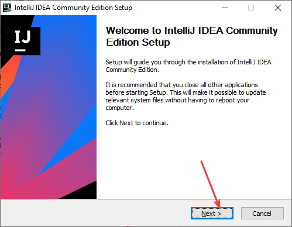

_Рисунок 3 — Начальное окно установки_

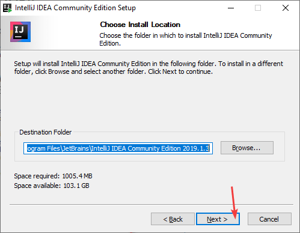

_Рисунок 4 — Выбор пути установки программы_

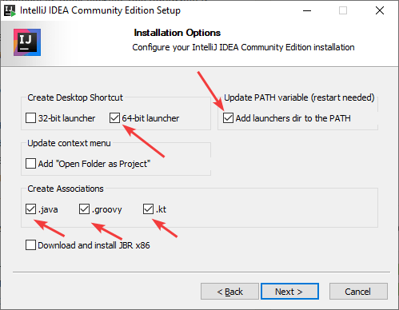

_Рисунок 5 — Выбор компонентов установки_

Если у вас 32-битная операционная система, то и выбираем 32-битные компоненты:

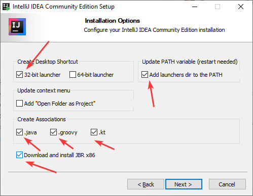

_Рисунок 6 — Выбор компонентов установки_

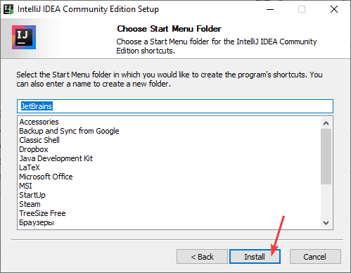

_Рисунок 7 — Выбор названия программы в меню_

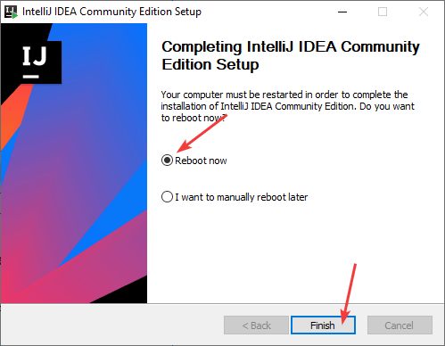

_Рисунок 8 — Окончание установки_

Программа установилась. Запускаем её, не забыв перезагрузить компьютер.

## Первоначальная настройка IntelliJ IDEA

При первом запуске спросит про импорт настроек с прежних установок данной программы. Если таковых не было, то говорите, что не хотите:

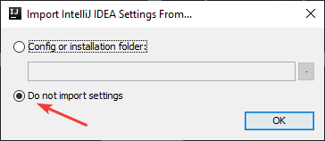

_Рисунок 9 — Импорт настроек_

Выбираем тему редактора. Мне нравится светлая тема. А также плагины выбираем по умолчанию:

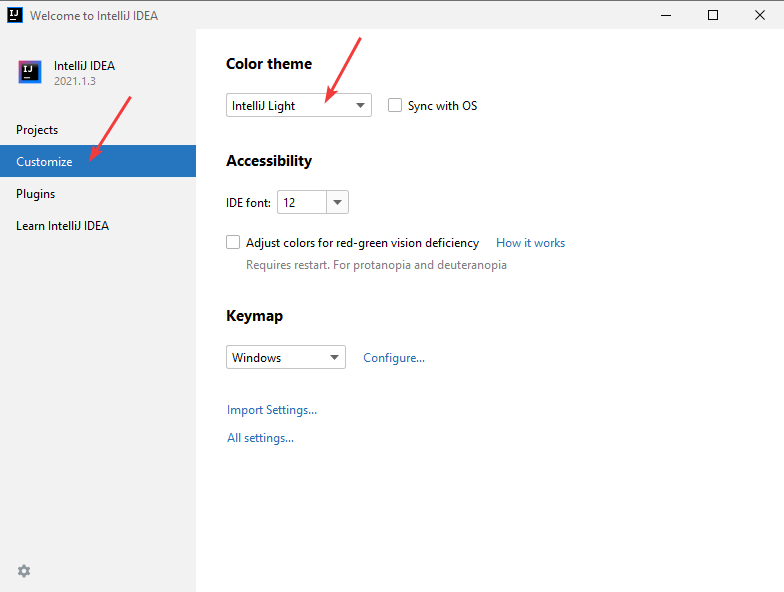

_Рисунок 10 — Подтверждение согласия с условиями_

## Создание нового приложения

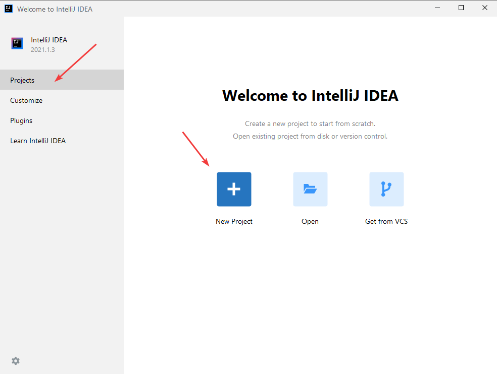

_Рисунок 11 — Создание нового проекта_

Если вы у себя видите на месте SDK фразу `No SDK` в отличии от скриншота внизу, то нужно вначале будет выбрать SDK, которым будем компилировать приложения, через кнопку `New...`:

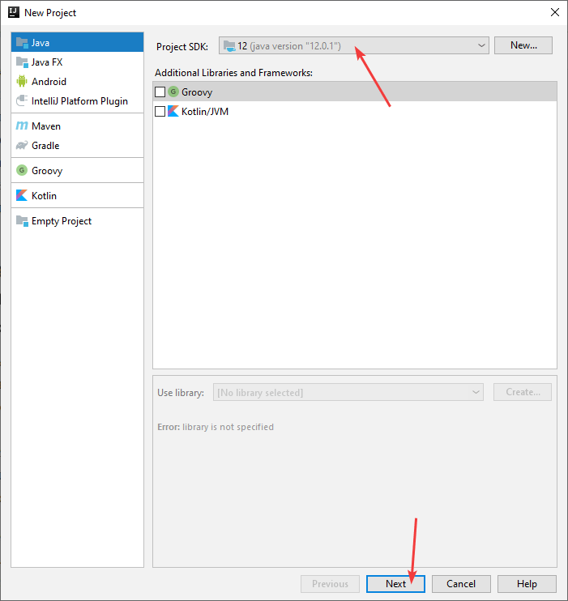

_Рисунок 12 — Создание проекта без JDK невозможно_

У меня JDK находится в папке `C:\Program Files\Java\jdk-12.0.1`. Выбираем это месторасположение (у вас может быть другое), если JDK не определяется автоматически.

Говорим, что хотим создать приложение уже с готовым шаблоном (будет присутствовать метод `Main`):

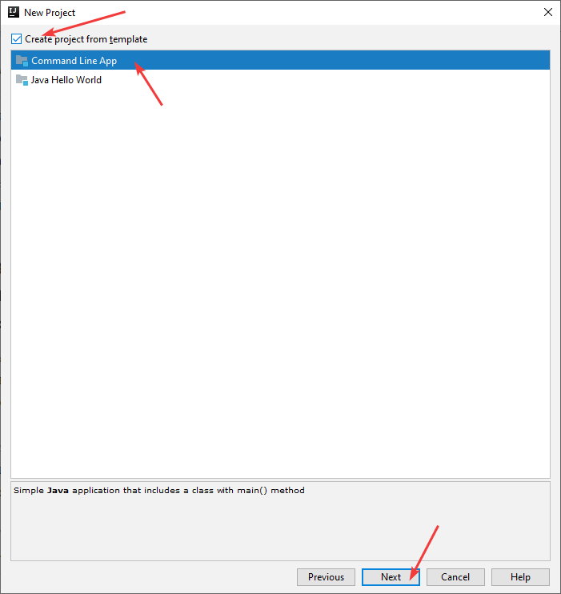

_Рисунок 13 — Выбор шаблона приложения_

Выбираем название проекта, папку для размещения проекта (по своему усмотрению):

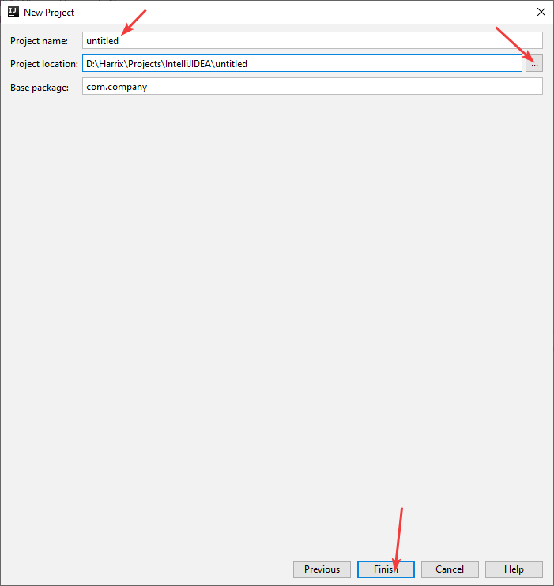

_Рисунок 14 — Выбор названия проекта_

Возможно, что вас спросят создать новую папку под проект. Соглашайтесь:

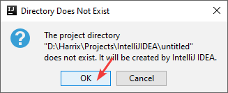

_Рисунок 15 — Создание папки под проект_

Всё. Создался проект консольного приложения Java. Если наверху справа появится желтая надпись `Attach annotations`, как на скриншоте внизу, то щелкните по ней:

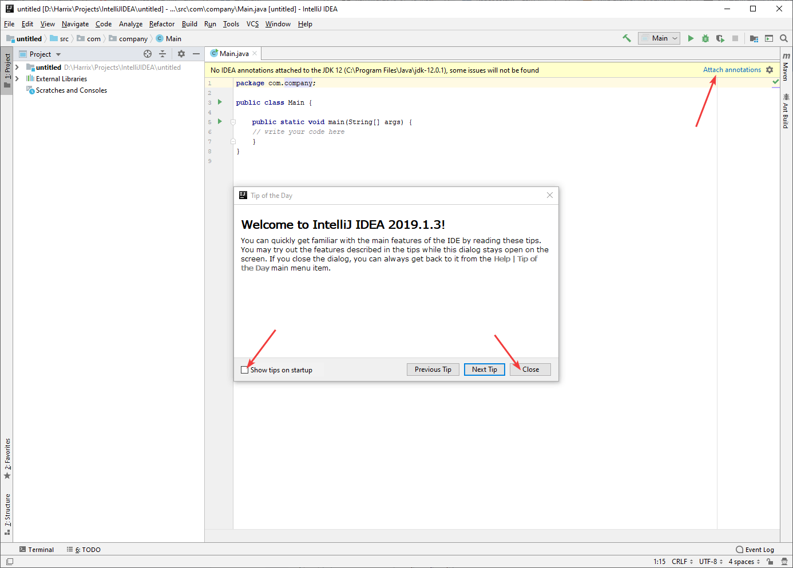

_Рисунок 16 — Выбор шаблона приложения_

## Запуск приложения

В методе `main` пропишем простейшую команду:

```java
System.out.println("Hello, World!");
```

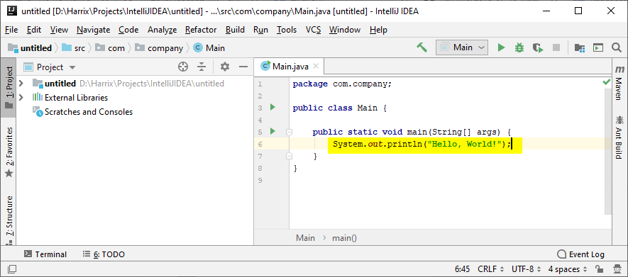

_Рисунок 17 — Строчка Java кода в методе Main_

Запустим проект:

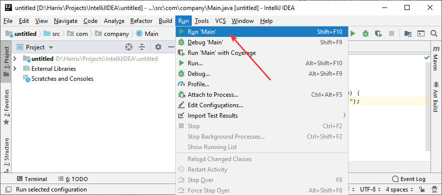

_Рисунок 18 — Запуск приложения_

В консоли отобразился результат выполнения программы:

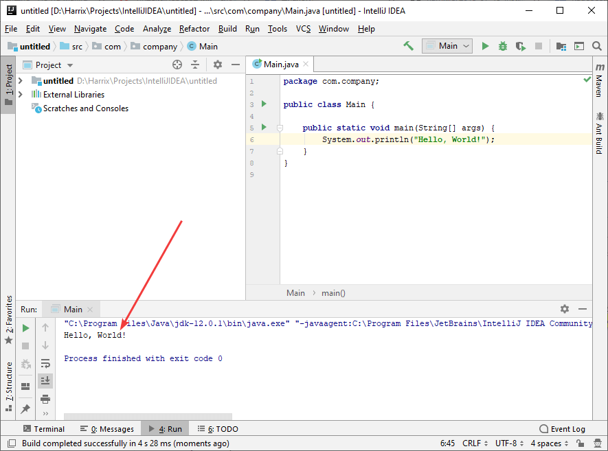

_Рисунок 19 — Запуск приложения_

## Дополнительные настройки

Настройки, описанные в данном разделе, опциональны, и можно их вообще не трогать.

Переходим в настройки приложения:

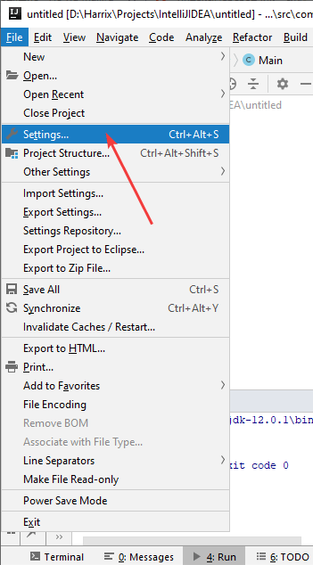

_Рисунок 20 — Настройки приложения_

В разделе `General` я ставлю возможность увеличения шрифта колесиком мыши при нажатом `Ctrl`, а также устанавливаю правило, что при сохранении файла все лишние пробелы справа у всех строк будут удаляться:

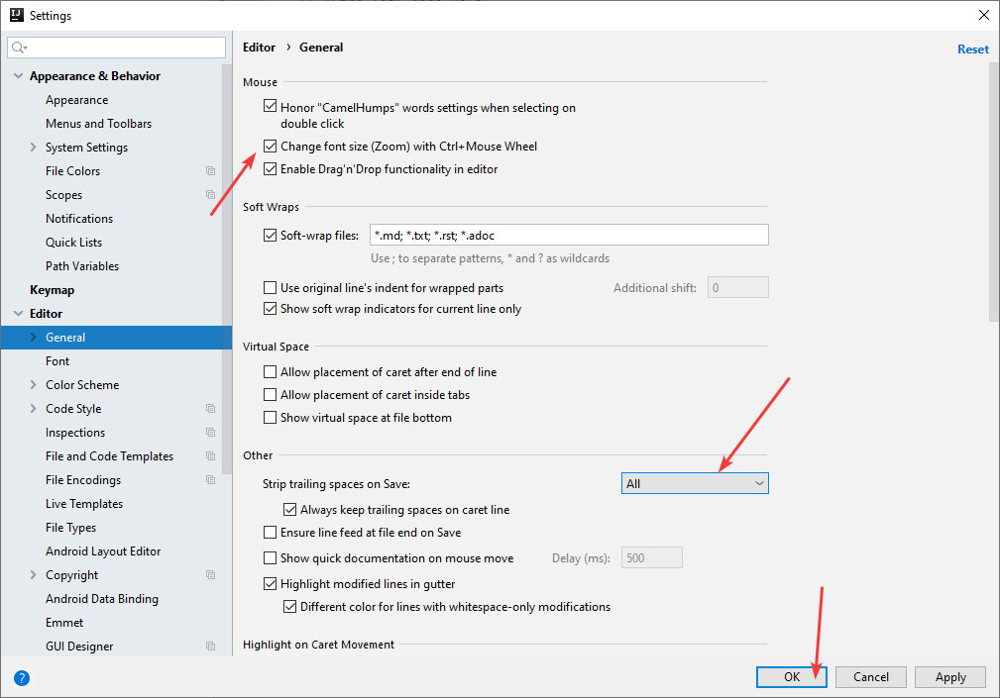

_Рисунок 21 — Дополнительные настройки приложения_

## Дополнительно

В статье [Сложение двух чисел в IntelliJ IDEA на Java (консольное приложение)](https://github.com/Harrix/harrix.dev-articles-2019/blob/main/add-2-num-intellij-idea/add-2-num-intellij-idea.md) | [↗️](https://harrix.dev/ru/articles/2019/add-2-num-intellij-idea/) вы можете посмотреть пример того, как сложить два числа.
