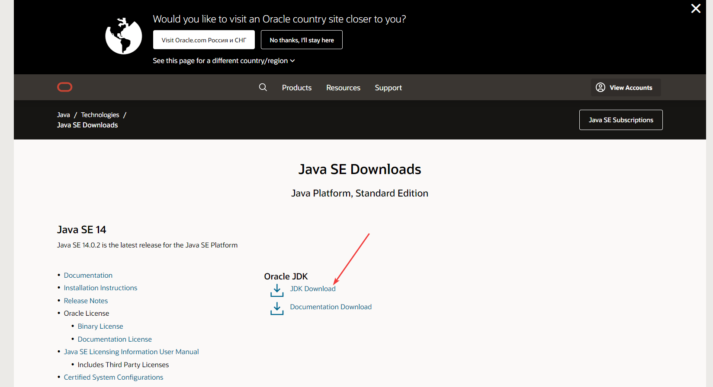
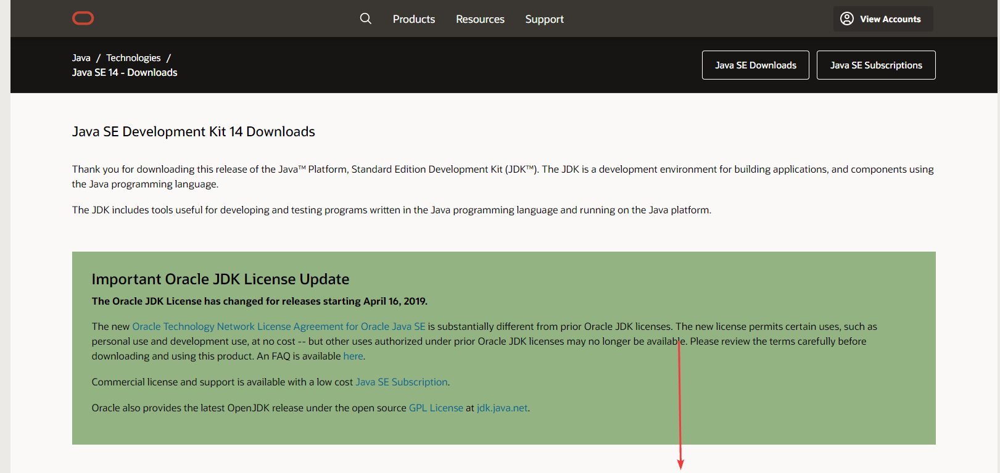
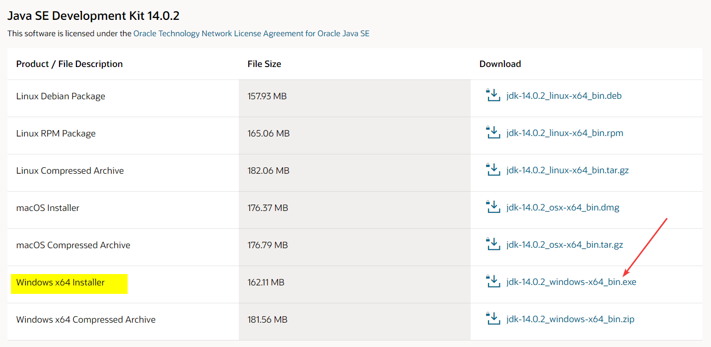
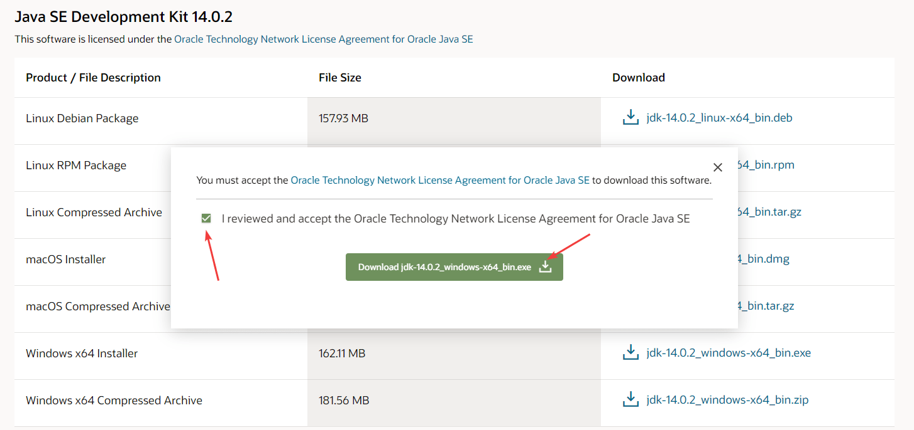
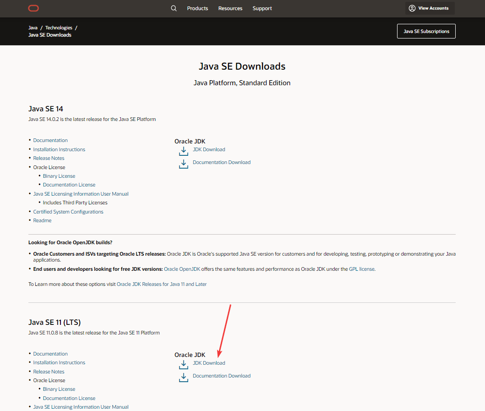
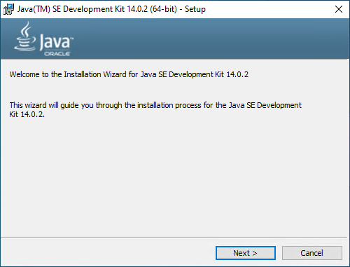
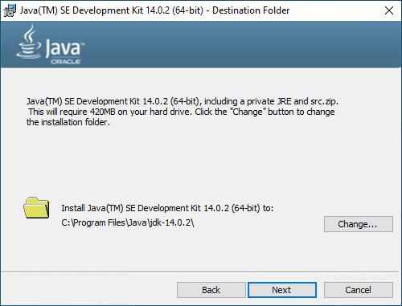
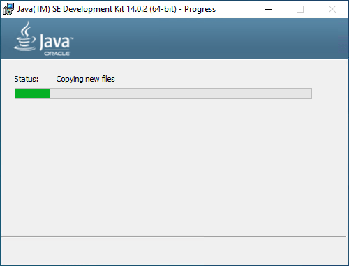
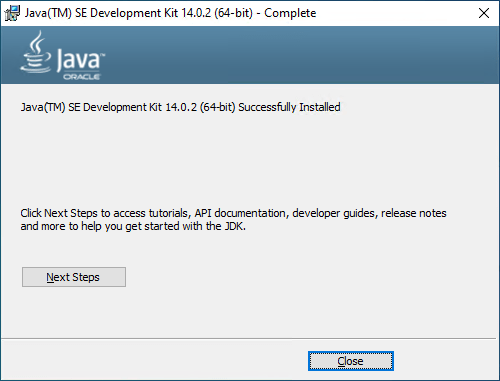

# Установка JDK в Windows

Для программирования под Java и, в частности, при создании приложений под Android на компе требуется установка JDK (Java Development Kit). В статье рассказывается как это сделать.

В статье рассматривается способ установки под Widows 10, но никакой разницы для других версий Windows не должно быть. Если вам нужна JDK более младшей версии или у вас, например, 32-битная Windows, то посмотрите [статью](https://github.com/Harrix/harrix.dev-blog-2014/blob/main/install-jdk-8-on-windows/install-jdk-8-on-windows.md) про установку JDK 8.

Скачиваем и устанавливаем с официального сайта:

<http://www.oracle.com/technetwork/java/javase/downloads/index.html>

Если у вас 32-битная операционная система, то скачивайте пакет под Windows x86. Для тех, кто не знает: версии программ для 64-битных операционных систем обозначаются **x64**, а для 32-битных обозначаются **x86**. Версии программ x86 можно устанавливать на 64-битные операционные системы, но лучше (за рядом некоторых исключений) устанавливать x64 версии. А версии программ x64 не получится установить на 32-битные операционные системы. В общем, выбираем:

Обратите внимание, что не всегда самая последняя версия Java подходит под ваши нужды. Например, на август 2020 года Android Studio не поддерживает Java 14 (Вылетает ошибка `Cause: invalid type code: 1C`). Поэтому в этом случае рекомендую установить предпоследнюю версию или более ранною:

При этом вам нужно будет иметь учетную запись на Oracle:

Процесс установки обычный и не представляет никаких трудностей:

